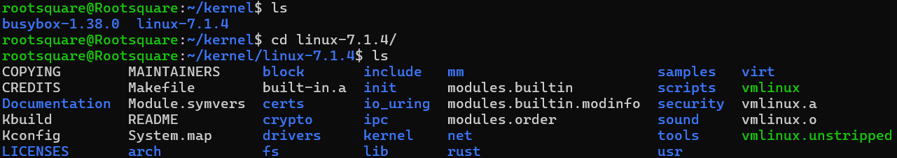
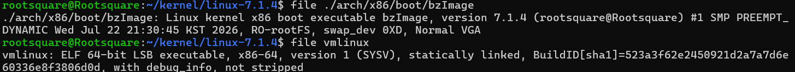
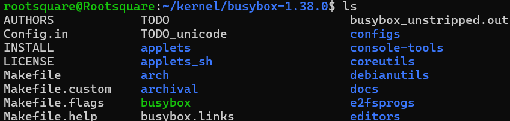
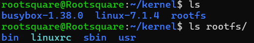
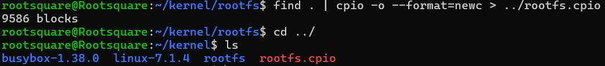
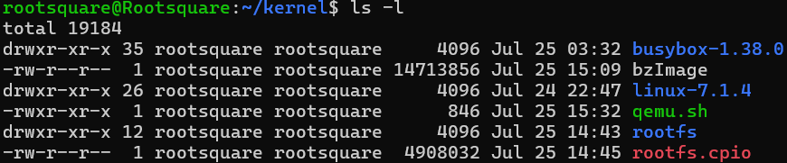
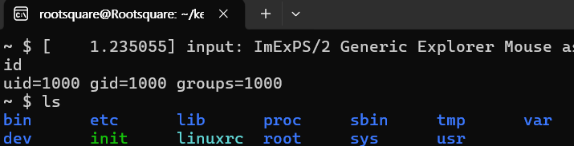

# 0-3. 실습 환경 구축하기

이제 리눅스 커널 해킹 실습을 위한 본격적인 환경을 구축해 봅시다.

운영체제 해킹 실습을 하려면 특정 운영체제가 설치된 컴퓨터 환경을 준비해야 하고, 응용 프로그램처럼 디버거를 장착하여 실제로 커널이 어떻게 동작하는지 확인할 수 있어야 합니다.

하지만 **운영체제 해킹은 내 컴퓨터(호스트) 환경에서 직접 실습하면 절대로 안 됩니다!** 운영체제는 시스템 전체를 관리하므로, 실습 도중 취약점을 건드리거나 익스플로잇 중 실수를 할 경우 커널이 즉시 패닉 상태가 되며 컴퓨터가 그대로 멈추어 버립니다. 그때마다 컴퓨터를 재부팅해야 한다면 실습이 매우 불편하겠죠? 최악의 경우, **운영체제가 영구적으로 손상되어 컴퓨터 부팅이 안 될 수도 있습니다!**

게다가 특정 문제나 사례별 실습을 할 경우, 문제마다 요구하는 특정 버전의 커널을 내 컴퓨터에 매번 설치하는 작업도 불가능에 가깝습니다.

다행히도 오픈 소스 생태계는 이 문제들을 완벽하게 해결해 줄 도구들을 제공합니다.

1. **커널 소스 코드** : [Linux 공식 홈페이지](https://www.kernel.org/)에서 우리가 원하는 모든 버전의 커널 코드를 언제든 다운로드 할 수 있습니다.
2. **가상 머신/에뮬레이터** : 리눅스에서 사용할 수 있는 가상화 소프트웨어로 QEMU가 있습니다. QEMU를 사용하면 내 컴퓨터 위에 가상의 컴퓨터 환경을 만들고, 그 환경 내에서 원하는 버전의 운영체제를 실행할 수 있습니다.

이제 리눅스 터미널 창을 열고(Windows 사용자는 WSL2), 홈 디렉토리에서 `mkdir kernel; cd kernel` 를 입력하여 커널 실습용 디렉토리를 만들어주세요.

```bash
sudo apt update
sudo apt-get install build-essential libncurses5 bin86 libncurses5-dev libssl-dev bison flex libelf-dev
```

이후 위의 명령어를 실행하여, 환경 구축에 필요한 프로그램들도 모두 설치해 주세요.

이제 실습에 필요한 요소들을 하나씩 제작해 봅시다. 앞으로 생성하는 모든 파일들은 실습용 kernel 디렉토리 안에서 해주세요.

## Linux 커널 이미지 만들기

소프트웨어 분야에서 이미지(Image)란, **특정 상태의 데이터를 메모리나 디스크에 올라갈 모습 그대로 복사해 놓은 바이너리 파일**을 뜻합니다. 리눅스 커널을 가상머신 위에서 구동하려면 바로 이 '커널 이미지'를 직접 만들어야 합니다.

먼저 [Linux 공식 홈페이지](https://www.kernel.org/)에서 리눅스 커널 소스의 압축 파일을 다운로드 받고, kernel 디렉토리로 옮기세요. 이후 `tar -xJf (압축 파일명)`을 실행하여 압축을 푸세요.(보통 tar 아카이브 형식으로 제공하며, xz로 압축이 되어 있습니다.) **필자는 7.1.4 버전의 커널을 기준으로 실습합니다.**



압축을 풀면 위 사진처럼 `linux-`로 시작하는 폴더가 생깁니다. 폴더 안으로 들어가 보면 수많은 커널 소스 파일들과 함께, 커널을 편리하게 빌드하도록 도와주는 `Makefile`이 있는 것을 확인할 수 있습니다.

이제 해당 폴더에서 아래와 같은 명령어들을 순서대로 실행하세요.

```bash
make defconfig # 기본 환경 설정을 불러옵니다.
# 아래 코드들은 실습의 편의를 위해 커널의 일부 보호 기능을 끄고, 디버깅 기능을 켭니다. 
# (강의를 따라가며 이 보호 기법들을 하나씩 다시 켜보고 우회하는 법을 배울 것입니다!)
./scripts/config --enable CONFIG_RANDOMIZE_BASE
./scripts/config --disable CONFIG_STACKPROTECTOR
./scripts/config --disable CONFIG_STACKPROTECTOR_STRONG
./scripts/config --enable CONFIG_PAGE_TABLE_ISOLATION
./scripts/config --enable CONFIG_DEBUG_KERNEL
./scripts/config --enable CONFIG_DEBUG_INFO_DWARF_TOOLCHAIN_DEFAULT
./scripts/config --enable CONFIG_KALLSYMS
./scripts/config --enable CONFIG_KALLSYMS_ALL
make olddefconfig # 변경된 환경 설정을 적용합니다.
make -j$(nproc) # 커널을 컴파일합니다. 이때 사용자 컴퓨터의 모든 프로세서를 사용합니다.
```

커널 컴파일은 시간이 꽤 오래 걸립니다. 여유를 가지고 기다리세요.



커널 컴파일이 완료되면, 위 사진과 같이 두 개의 커널 파일이 만들어집니다.

|이름|설명|
|---|---|
|vmlinux|압축되지 않은 커널 ELF 바이너리입니다. 심볼(Symbol) 정보를 담고 있어 **GDB 디버깅 시 커널 내부 함수와 주소를 파악할 때 사용**합니다.|
|bzImage|압축된 형태의 실행 가능한 커널 이미지입니다. **QEMU 가상머신을 실제로 부팅시킬 때 사용합니다.**|

이제 `./arch/x86/boot/bzImage` 파일을 복사해서 어딘가에 저장하세요. 이것이 부팅에 필요한 커널 이미지입니다!

## 루트 파일 시스템(rootfs) 만들기

파일 시스템은 컴퓨터가 저장장치에서 필요한 데이터를 찾거나, 데이터를 저장하기 위해 사용하는 시스템입니다.

리눅스에서 루트 파일 시스템이란, **시스템의 최상위 디렉토리에 마운트되는 파일 시스템입니다.** 이 영역에 부트로더, 커널 등 부팅에 필수적인 파일들이 위치합니다. 예를 들어, `/boot` 에는 부트로더, `/dev`에는 장치 파일, `/etc`에는 설정 파일 등이 있습니다.(리눅스에서는 모든 것을 파일로 관리합니다!)

실습을 할 때는 호스트 컴퓨터의 파일 시스템을 쓸 게 아니라 실습용 파일 시스템을 따로 만들어야겠지요? 오픈 소스 프로젝트 중 [Busybox](https://www.busybox.net/)을 사용하여 실험용 파일 시스템을 만들어 봅시다. 아래의 명령어를 실행하여 kernel 디렉토리에 Busybox을 다운로드받고 압축을 푸세요.

```bash
# 다운로드 받으시는 파일은 아무 것이든 좋습니다. 최신 버전을 사용하시는 것을 추천합니다.
wget https://busybox.net/downloads/busybox-1.38.0.tar.bz2
tar -xjf busybox-1.38.0.tar.bz2
cd busybox-1.38.0/
```

실행하시면 아래 사진처럼 busybox의 파일들이 배치되어 있는 모습을 볼 수 있습니다.



먼저 `make menuconfig`을 입력하여 빌드에 필요한 옵션들을 설정합니다. 최신 환경에서는 다음을 설정하세요.

1. Settings -> Build Options -> Built static binary 옵션 설정
2. Network Utilities -> inetd 옵션 해제
3. Networking Utilities -> tc 옵션 해제

이후 설정을 저장하고 `make CONFIG_PREFIX=../rootfs install` 로 루트 파일 시스템을 생성합니다. 실행이 끝나면 kernel 디렉토리에 rootfs 라는 디렉토리가 생성됩니다.

파일 시스템 역시 make에 시간이 오래 걸립니다. 여유를 가지고 기다리세요.



실행이 완료되었을 때 위 사진처럼 kernel 디렉토리에 rootfs 라는 디렉토리가 있어야 합니다. 현재 rootfs에는 최소한의 파일들만 있으며, 이것만으로는 부팅을 할 수 없습니다. `cd rootfs`로 해당 디렉토리로 이동하고, 다음 명령어들을 순서대로 실행해 주세요.

```bash
mkdir var dev etc lib proc tmp sys # 실제 파일 시스템처럼 필요한 파일들을 만듭니다.
mkdir ./lib/x86_64-linux-gnu # 실험 환경에서 프로그램이 참조할 라이브러리 파일들이 저장될 곳을 설정합니다.
# 실습의 편의성을 위해 여러분의 호스트 컴퓨터에 있는 라이브러리 및 링커를 실습 환경의 lib 디렉토리에도 넣어 줍니다.
cp /lib/x86_64-linux-gnu/libc.so.6 ./lib/x86_64-linux-gnu/libc.so.6
cp /lib/x86_64-linux-gnu/ld-linux-x86-64.so.2 ./lib/x86_64-linux-gnu/ld-linux-x86-64.so.2
touch init # 리눅스가 부팅한 이후 최초로 실행할 프로세스(스크립트)를 생성합니다.
chmod 755 init # 해당 스크립트 파일에 실행 권한을 부여합니다.
```

여기서 init에 주목하세요.

```bash
#!/bin/sh

# 필요한 파일 시스템을 마운트하고, 표준 입출력 방향을 설정합니다.
mount -t proc none /proc
mount -t sysfs none /sys
mount -t devtmpfs devtmpfs /dev
exec 0</dev/console
exec 1>/dev/console
exec 2>/dev/console

# 디버깅을 편하게 하기 위해 설정합니다.
echo "7 4 1 7" > /proc/sys/kernel/printk
cp /proc/kallsyms /tmp/kallsyms

# 유저 권한으로 사용자가 로그인합니다.
setsid cttyhack setuidgid 1000 sh

umount /proc
umount /sys
poweroff -d 0  -f
```

이제 모든 준비가 끝났습니다! `find . | cpio -o --format=newc > ../rootfs.cpio`을 실행하여, 현재 만들어진 파일 시스템을 압축해서 하나의 파일로 만들어주세요.



실행 결과 다음 사진처럼 rootfs\.cpio 가 kernel 디렉토리에 보인다면 잘 하신 겁니다!


## QEMU 설치하기

QEMU(Quick Emulator)는 다양한 아키텍처 및 운영체제를 에뮬레이션(Emulation) 하는데 사용하는 소프트웨어로, 가상의 컴퓨터 환경에서 여러 실험을 할 수 있습니다.

응용 프로그램들과는 달리 커널은 크래시가 발생하면 운영체제 전체가 멈춥니다. 그때마다 컴퓨터를 다시 부팅해야 한다면 매우 불편하겠죠?

QEMU 환경에서는 실행 중 커널이 멈추면, 프로세스를 닫고 다시 QEMU를 부팅하면 되므로 매우 편리합니다.

아래와 같은 명령어들을 순서대로 실행하여 QEMU를 설치하세요.

```bash
sudo apt install qemu-utils qemu-system-x86 qemu-kvm
qemu-system-x86_64 -version
```

실행 결과 QEMU의 버전이 잘 출력되면 바르게 설치된 것입니다!

## 운영체제 실행하기

이제 모든 준비가 끝났습니다! 이제 우리가 위에서 만든 커널 이미지, 루트 파일 시스템을 QEMU를 사용해서 설치하면 됩니다.

우선 아래의 명령어를 사용하여, `linux-` 디렉토리 안에 저장된 커널 이미지를 복사합시다.

```bash
cp ./linux-7.1.4/arch/x86/boot/bzImage .
```

그 다음, `touch qemu.sh`를 실행하여, 간편하게 QEMU로 새 커널을 실행하기 위한 스크립트 파일을 만드세요. 이후 아래와 같은 스크립트를 입력하세요. 입력을 끝냈으면 `chmod 755 qemu.sh`를 입력하여 실행 권한을 부여하세요.

```bash
#!/bin/sh

# [QEMU 실행 옵션 설명]
# -m 512M: 메모리 용량 512MB 할당
# -kernel: 사용할 커널 이미지 (bzImage)
# -initrd: 사용할 루트 파일시스템 (rootfs.cpio)
# -append: 커널 부팅 파라미터 (nokaslr, nopti, nosmep, nosmap 등 보안 장치 완전 비활성화)
# -netdev / -device: e1000 네트워크 장치 연결
# -nographic: GUI 없이 현재 터미널 콘솔로 출력을 연결
# -cpu host / -enable-kvm: 호스트 CPU 특성 전달 및 KVM 가속 활성화
# -s: GDB 디버깅용 1234 포트 오픈

qemu-system-x86_64 \
    -m 512M \
    -kernel ./bzImage \
    -initrd ./rootfs.cpio \
    -append "root=/dev/ram rw console=ttyS0 oops=panic panic=1 quiet nokaslr nopti nosmep nosmap" \
    -netdev user,id=t0 -device e1000,netdev=t0,id=nic0 \
    -nographic \
    -cpu host \
    -enable-kvm \
    -s

```

kernel 디렉토리에서 아래 사진과 같이 bzImage, rootfs, qemu\.sh 가 모두 보이면 성공입니다!



이제 커널 환경을 구동해 봅시다! `sudo qemu.sh`를 입력하여 QEMU를 실행하세요!(하드웨어 가속에 관리자 권한이 필요합니다.)



새 터미널 창이 부여지고, id, ls 명령어가 위 사진처럼 잘 실행되면 성공입니다.

축하합니다! 실습을 위한 환경 구축이 완료되었습니다. 아직은 실험 환경만 있으므로 할 수 있는 것이 별로 없습니다.

다음 강의부터는 커널 모듈을 설명하고, 취약한 모듈을 하나씩 만들고 공격해 보면서 실습을 진행하겠습니다.