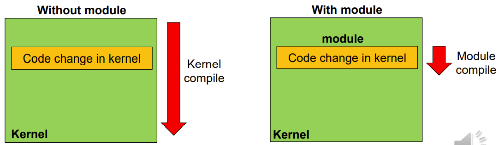
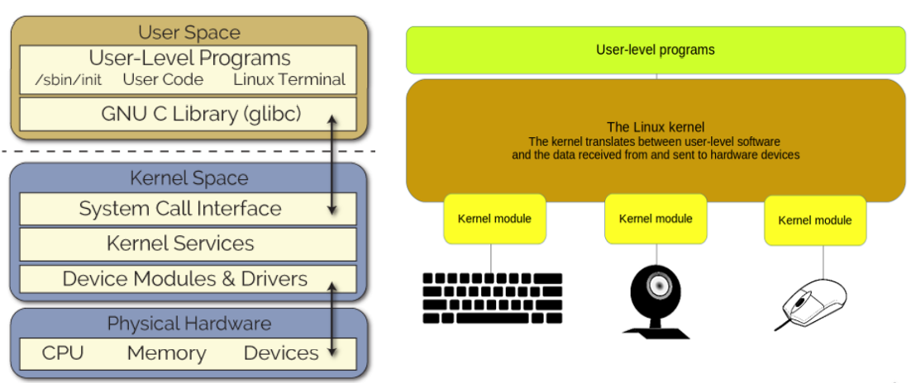
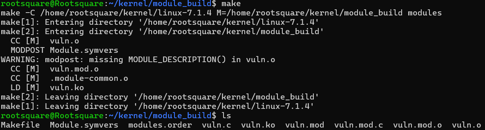

# 1-1. 커널 모듈 이해하기

Linux 에서 커널 모듈이란 **커널에 동적으로 적재/제거할 수 있는 코드 조각**을 의미합니다. 리눅스는 적재가능 커널 모듈(Loadable Kernel Module)을 지원하며, 시스템을 재부팅 또는 다시 빌드 하지 않고도 커널의 기능을 확장할 수 있는 장점이 있습니다.



위 사진은 모듈 방식의 장점을 잘 보여줍니다. 모놀리틱 커널은 커널 코드가 한 줄만 수정되어도 전체 커널을 다시 컴파일 해야하지만, 모듈을 사용할 경우 특정 모듈을 수정하면 해당 모듈만 다시 컴파일 후 모듈에 새로 적재하면 됩니다!

## 커널 모듈은 어디에 쓰일까?

리눅스에서는 `lsmod`를 사용하여 현재 적재된 커널 모듈의 목록을 볼 수 있으며, `insmod`, `rmmod` 를 사용하여 새 모듈을 적재하거나 기존 모듈을 제거할 수 있습니다.



모듈은 주로 **커널이 하드웨어와 통신할 수 있도록 해주는 디바이스 드라이버**에 사용됩니다. 키보드, 마우스, 스피커, 헤드셋 같은 입출력 장치들도 커널 모듈을 사용하여 제어합니다! 그 외에도 파일 시스템 드라이버, 네트워크 프로토콜/방화벽 등도 커널 모듈에 해당합니다.

## 커널 모듈은 어떻게 만들까?

리눅스에서 커널 모듈은 C언어로 제작됩니다. 단, 이 프로그램은 리눅스의 커널 모듈에서 동작하므로, 일반적인 응용 프로그램과는 달리 정해진 규격을 지켜서 작성해야 합니다.

다음은 리눅스 커널 모듈의 예시 소스 코드입니다.

```c
#include <linux/module.h> // 모든 커널 모듈에 필요한 필수 헤더
#include <linux/kernel.h> // KERN_INFO 등의 로그 레벨 선언
#include <linux/init.h>   // __init, __exit 매크로 정의

// 1. 모듈 로드 시 실행되는 함수 (초기화)
static int __init my_module_init(void) {
    printk(KERN_INFO "Hello, Kernel World!\n");
    return 0; // 0을 반환해야 성공적으로 로드됨
}

// 2. 모듈 제거 시 실행되는 함수 (정리)
static void __exit my_module_exit(void) {
    printk(KERN_INFO "Goodbye, Kernel World!\n");
}

// 3. 커널 매크로 등록 (진입점과 종료점 지정)
module_init(my_module_init);
module_exit(my_module_exit);

// 4. 모듈 라이선스 및 정보 지정
MODULE_LICENSE("GPL");
MODULE_AUTHOR("Rootsquare");
MODULE_DESCRIPTION("A Simple Linux Kernel Module Example");
```

리눅스용 커널 모듈은 `#include <linux/module.h>` 헤더를 사용하여 이것이 커널 모듈임을 표시합니다. `module_init` 와 `module_exit` 매크로는 커널의 진입점/종료점으로, 모듈이 커널에 적재/제거 될 때 실행하는 함수를 정의합니다. 실행하는 함수는 `__init`,`__exit` 태그를 붙여 진입점/종료점을 지정합니다.

여기서 `printk` 라는 함수가 보이시나요? 우리가 `printf`를 사용하여 응용 프로그램에서 콘솔 화면에 문자열을 출력하듯, 커널 영역에서는 `printk`를 사용하여 터미널 로그에 문자열을 출력합니다. 터미널 로그는 터미널에서 `dmesg` 명령어를 실행하면 읽을 수 있습니다.

주의할 점은, **커널 영역은 사용자 영역과 완전히 분리되어 있으므로 우리가 흔히 쓰던 표준 C 라이브러리(libc) 함수들을 마음대로 쓸 수 없다는 것입니다.** 커널은 커널만의 전용 함수 세트를 따로 가지고 있답니다!(리눅스 커널은 모놀리틱 구조인 것을 기억하시죠? 커널 바이너리 파일인 vmlinux 를 IDA Free 등으로 분석하면 커널이 사용하는 함수들을 볼 수 있습니다.)

## 커널 모듈이 사용자와 소통하게 하려면?

앞선 코드는 커널에 적재될 때 인사말 한 줄을 남기는 것 외에는 별다른 기능이 없습니다. 모듈을 실제로 활용하고, 나아가 우리가 '해킹(공격)'을 해보려면 모듈이 사용자(User Space)와 데이터를 주고받으며 소통할 수 있어야겠죠?

리눅스는 **모든 것을 파일로 관리합니다!(하드웨어 장치, 디렉토리, 드라이버 등 모든 요소를 말합니다!)** 따라서 커널 모듈이 사용자와 소통하려면 가장 먼저 `/dev` 폴더 아래에 자신만의 가상 장치 파일(캐릭터 디바이스, Character Device)을 만들어야 합니다.

사용자가 **이 장치 파일을 열고(open), 읽고(read), 쓰고(write), 명령을 내릴때(ioctl)**, 커널 모듈이 그 행동을 받고 자신의 코드를 실행합니다.

이것을 구현하기 위하여, 위에서 작성한 모듈 파일에 약간의 뼈대(보일러플레이트 코드)를 추가해 줍시다.

```c
#include <linux/module.h>
#include <linux/kernel.h>
#include <linux/fs.h>
#include <linux/uaccess.h> // copy_from_user 사용을 위해 필수
#include <linux/device.h>  // 장치 파일 자동 생성을 위해 필수

#define DEVICE_NAME "vuln"
#define CLASS_NAME "vuln_class"

MODULE_LICENSE("GPL");
MODULE_AUTHOR("Rootsquare");
MODULE_DESCRIPTION("Vulnerable Kernel Module for Education");

static int major_number;
static struct class* vuln_class = NULL;
static struct device* vuln_device = NULL;

// ---------------------------------------------------------
// [목표 함수] 해커(사용자)가 실행 흐름을 조작하여 도달해야 하는 도착지입니다.
// ---------------------------------------------------------
void win_function(void) {
    printk(KERN_INFO "[VULN] Flag is B1N4RY{H3llo_my_f1rst_kernel_h4cking}\n");
    panic("Mission Clear"); // 시스템을 고의로 패닉 상태로 만들어 공격 성공을 알림
}
EXPORT_SYMBOL(win_function);

/* 사용자가 /dev/vuln 에 write를 하면 실행되는 함수입니다. */
static ssize_t dev_write(struct file* filep, const char __user* buffer, size_t len, loff_t* offset) {
    char k_buffer[64]; // 커널 스택에 64바이트 공간 할당

    printk(KERN_INFO "[VULN] Received %zu bytes from user\n", len);

    /* 사용자 입력을 커널 버퍼에 기록합니다.*/
    if (copy_from_user(k_buffer, buffer, len)) {
        return -EFAULT;
    }

    return len;
}

/* 보일러플레이트. file_operations 에는 사용자가 파일에 특정 시스템 호출이 전달되었을 때 실행할 코드를 대신 써준다. */
static struct file_operations fops = {
    .write = dev_write, // 사용자가 write()를 호출하면, 우리가 만든 dev_write가 실행됨
};

/* 모듈이 적재될 때 실행. */
static int __init vuln_init(void) {
    // 1. 캐릭터 디바이스 번호(Major Number) 동적 할당
    major_number = register_chrdev(0, DEVICE_NAME, &fops);
    if (major_number < 0) return major_number;

    // 2. 디바이스 클래스 생성
    vuln_class = class_create(CLASS_NAME);
    if (IS_ERR(vuln_class)) {
        unregister_chrdev(major_number, DEVICE_NAME);
        return PTR_ERR(vuln_class);
    }

    // 3. /dev/vuln 장치 파일 자동 생성 (사용자가 접근할 수 있는 통로)
    vuln_device = device_create(vuln_class, NULL, MKDEV(major_number, 0), NULL, DEVICE_NAME);
    if (IS_ERR(vuln_device)) {
        class_destroy(vuln_class);
        unregister_chrdev(major_number, DEVICE_NAME);
        return PTR_ERR(vuln_device);
    }

    printk(KERN_INFO "[VULN] Module loaded. Device created at /dev/vuln\n");
    return 0;
}

/* 모듈이 제거될 때 실행 */
static void __exit vuln_exit(void) {
    device_destroy(vuln_class, MKDEV(major_number, 0));
    class_destroy(vuln_class);
    unregister_chrdev(major_number, DEVICE_NAME);
    printk(KERN_INFO "[VULN] Module unloaded.\n");
}

module_init(vuln_init);
module_exit(vuln_exit);
```

처음부터 이 코드의 모든 것을 이해하려 할 필요는 없습니다. 이 모듈을 적재하면, 컴퓨터에 `/dev/vuln` 이라는 모듈 파일이 생성되어 사용자가 이 모듈과 소통할 수 있게 됩니다.

```c
#include <stdio.h>
#include <stdlib.h>
#include <fcntl.h>
#include <unistd.h>
#include <string.h>

int main() {
    // 모듈에 접근하기
    int fd = open("/dev/vuln", O_RDWR);
    if (fd < 0) {
        perror("[-] Failed to open /dev/vuln");
        return -1;
    }

    /* 보낼 메시지 작성하기 */
    char payload[200] = { 0 };
    memset(payload, 'A', 64);

    /* 모듈에 write 시스템 콜을 사용하여 모듈과 소통한다. */
    write(fd, payload, 64);

    close(fd);
    return 0;
}
```

사용자 영역에서는 위와 같은 C 코드를 실행하여 모듈과 소통할 수 있습니다! 마치 일반 문서 파일을 읽고 쓰듯, 사용자는 open() 시스템 호출로 `/dev/vuln` 에 접근하고, write() 시스템 호출로 모듈에 값을 전달합니다.

## 커널 모듈 컴파일하기

이제 위에서 작성한 커널 모듈 소스 코드(vuln\.c)를 컴파일하여 실제 모듈 파일로 만들어 봅시다.

하지만 커널 모듈은 우리가 흔히 쓰던 `gcc vuln.c -o vuln` 같은 간단한 명령어로 컴파일되지 않습니다! 커널의 복잡한 뼈대와 규칙들을 참조해야 하므로, 빌드 규칙을 적어둔 **Makefile**이 반드시 필요합니다.

소스 코드가 있는 폴더에 Makefile이라는 이름으로 새 파일을 만들고 아래 코드를 작성해 주세요. (첫 글자 M은 반드시 대문자여야 합니다!)

```Makefile
obj-m += vuln.o

# 앞서 0장에서 직접 컴파일했던 리눅스 커널 소스 폴더의 '절대 경로'를 적어주세요.
# 예: KDIR := /home/user/kernel/linux-7.1.4
KDIR := (커널 파일이 있는 경로)
PWD := $(shell pwd)

# 주의! 여기서 들여쓰기는 반드시 탭(Tab) 한 번을 입력해야 합니다! 스페이스바를 입력하면 Makefile을 읽지 못하고 오류가 발생합니다.
default:
	$(MAKE) -C $(KDIR) M=$(PWD) modules

clean:
	$(MAKE) -C $(KDIR) M=$(PWD) clean
```

이제 이 상태로 `make` 명령어를 입력하면, 커널 모듈이 완성됩니다!



위 사진처럼 모듈 소스 파일인 vuln\.c 와 Makefile을 같은 자리에 놓고 `make`를 하면 여러 파일이 만들어집니다. 여기서 **vuln\.ko 파일이 최종적으로 완성된 모듈 파일입니다!**

### 모듈을 만들다 오류가 발생했거나 다시 만들고 싶어요. 어떻게 해야 하나요?

모듈 빌드를 다시 하고 싶으면 `make clean` 으로 빌드 환경을 초기화해 주시고, 소스 파일을 수정한 이후 `make`를 다시 실행해 주세요. 빌드가 잘 될 것입니다.