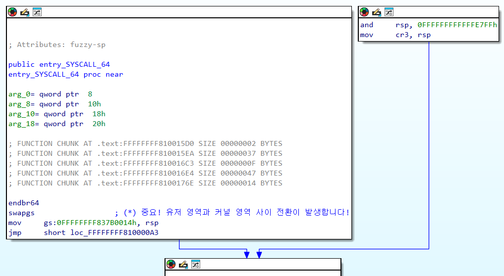

## 시스템 호출이란 무엇일까요?


## 시스템 호출 실험하기


```c
#include<unistd.h>
int main(void)
{
    char word[]="Hello World!\n";
    write(1,word,13);
    return 0;
}
```


이것은 GDB를 사용하여 위 프로그램에서 `write`가 실행되는 시점을 포착한 것입니다. 그런데 자세히 살펴보시면, `call write@plt`라는 **함수**가 실행되는 것이 눈에 보이시나요?

사실 우리가 `unistd.h` 에서 가져온 `write()` 함수 자체는 커널 코드가 아니라, 사용자 영역에 있는 C 표준 라이브러리(glibc)에 정의된 래퍼(Wrapper) 함수입니다. 사용자는 커널 영역에 정의된 실제 시스템 호출 함수인 `ksys_write` 를 실행할 권한이 없습니다!

이 래퍼 함수는 `syscall` 명령어를 실행하기 이전에, **운영체제가 사용자의 시스템 호출을 이해할 수 있도록 레지스터에 값을 설정합니다.** 필요한 값들은 아래와 같습니다.

|레지스터|필요한 값|
|---|---|
|rax|시스템 호출 고유의 번호입니다. 커널은 이 번호를 보고 어떤 작업을 할지 결정합니다.|
|rdi,rsi,rdx,rcx...|함수의 인자처럼, 시스템 호출에 필요한 인자들을 전달합니다. 레지스터 순서는 x86-64 의 함수 호출 규약(Calling Convention)을 따릅니다.|

아래 사진은 libc에 정의된 `write()` 가 실제로 실행되는 모습을 보여줍니다.


`write+13` 의 `mov eax, 1`은 `sys_write`의 시스템 호출 번호인 1을 eax 레지스터에 넣고, `write+18`의 `syscall`이 실제로 프로그램이 운영체제에 시스템 호출을 보내는 지점입니다!

하지만 아쉽게도, 이 `syscall`이 호출될 때 실제로 RIP이 어디로 옮겨지며, 어떤 코드가 실행되는지는 GDB로 추적할 수 없습니다.

## vmlinux 분석하기



이


이후 `do_syscall_64` 에서 실제 시스템 호출 작업이 발생합니다! 해당 함수에서는 커널 내부에 정의된 시스템 호출 테이블(배열)을 보고, **해당 테이블에서 이번에 실행할 함수(rax 레지스터의 값을 확인합니다)를 선택하여 실행합니다.** `ksys_write`도 여기에 정의되어 있습니다.

시스템 호출 작업이 끝났으면, 이제 레지스터를 호출하고


## entry