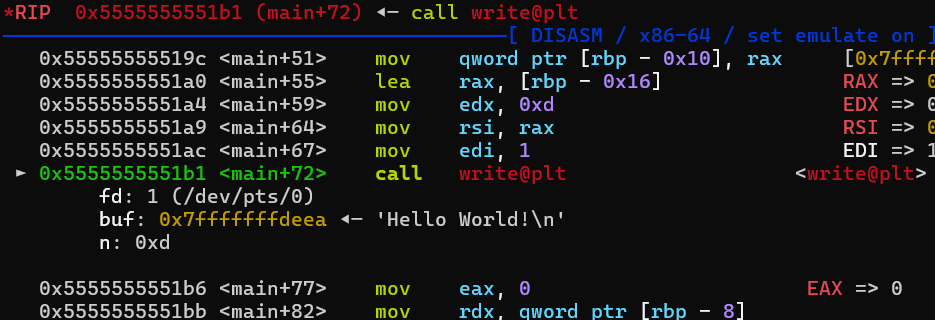
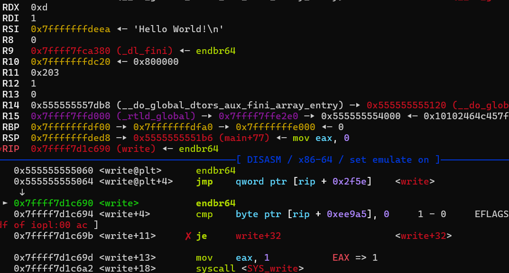
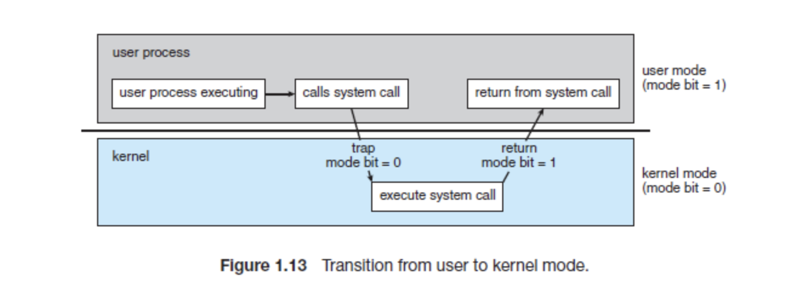

# 2-1. 시스템 호출(System Call) 깊게 이해하기

앞서 1장에서 첫 번째 커널 해킹 실습을 진행할 때, 우리는 C 코드에서 `open()`, `write()` 같은 함수를 사용해 커널 모듈과 소통했습니다.

그렇다면 사용자가 이런 함수들을 호출했을 때, 커널 내부에서는 정확히 어떤 일들이 벌어질까요?

이번 장에서는 사용자 영역(Ring 3)과 커널 영역(Ring 0)을 이어주는 유일한 다리, <b>시스템 호출(System Call)</b>에 대해 아주 자세히 파헤쳐 보겠습니다.

## 시스템 호출이 뭐야?

시스템 호출은 쉽게 말해 <b>사용자 영역의 프로그램이 커널의 권한과 기능을 빌려 쓰기 위해 커널에게 정중하게 부탁하는 공식적인 창구(인터페이스, Interface)</b> 입니다.

컴퓨터 환경에서 사용자 영역과 커널 영역은 엄격하게 분리되어 있습니다. 일반적인 응용 프로그램은 파일 읽고 쓰기, 네트워크 통신, 화면 출력 등 하드웨어를 직접 제어해야 할 때 스스로 그 작업을 수행할 권한이 없습니다.

따라서 사용자는 운영체제에게 특정한 작업을 대신 실행해 달라고 요청을 보내야 하는데, 이 요청을 보내는 행위 자체가 바로 시스템 호출입니다. 운영체제에는 수백 개가 넘는 시스템 호출이 정의되어 있으며, 기능에 따라 프로세스 제어, 파일 관리, 통신 등으로 나뉩니다.

아래 표는 우리가 자주 사용하는 몇 가지 시스템 호출의 예시입니다. 재미있는 점은 같은 기능을(예: 파일 열기) 하더라도 운영체제마다 시스템 호출의 이름이 다르다는 것입니다.

|범주|Windows의 시스템 호출|Linux의 시스템 호출|
|---|---|---|
|프로세스 제어|CreateProcess()<br>ExitProcess()<br>WaitForSingleObject()|fork()<br>exit()<br>wait()|
|파일 관리|CreateFile()<br>ReadFile()<br>WriteFile()<br>CloseHandle()|open()<br>read()<br>write()<br>close()|
|정보 유지|GetCurrentProcessID()<br>SetTimer()<br>Sleep()|getpid()<br>alarm()<br>sleep()|


- 💡Tip : [이 사이트](https://syscalls.mebeim.net/?table=x86/64/x64/latest)를 방문하면 리눅스(x86_64)에 정의된 300여 개의 시스템 호출 전체 목록과 번호를 한눈에 보실 수 있습니다!

## 응용 프로그래밍 인터페이스(API)와 시스템 라이브러리

전 세계의 수많은 개발자들이 웹 서버, 비디오 게임, 메신저 등을 만들 때 프로그램은 초당 수천-수만 번씩 시스템 호출을 합니다. 그런데 대부분의 개발자들은 코딩을 하면서 자신들이 시스템 호출을 사용하고 있다는 사실을 눈치채지 못합니다. 왜 그럴까요?

사실, **응용 프로그램은 커널 내부에 정의된 진짜 시스템 호출 함수를 '직접' 호출할 수 없습니다.** 커널은 사용자 영역과 분리되어 있기 때문입니다. 그 대신, 운영체제가 프로그래머들을 위해 미리 만들어둔 편리한 포장지, <b>응용 프로그래밍 인터페이스(Application Programming Interface, API)</b>를 사용합니다.

API는 각 함수마다 전달되어야 할 매개변수와 함수가 하는 작업, 프로그래머가 기대하는 반환값이 정의되어 있습니다. 이 세트는 운영체제마다 조금씩 다르며, 리눅스는 POSIX API를 사용합니다.

리눅스에서는 이 API들을 C언어로 구현해서 모아둔 거대한 패키지가 있는데, 이것이 바로 <b>시스템 라이브러리(System Library, 대표적으로 libc)</b>입니다.

### API를 식당에 비유해 봅시다

사용자가 시스템 호출을 하는 과정을 식당에서 손님이 식사를 주문하는 것에 비유해 봅시다.

1. 손님(응용 프로그램)은 주방에 들어가 요리(하드웨어 제어)를 직접 할 수 없습니다.
2. 손님은 종업원(`libc`의 API 함수)에게 원하는 메뉴(실행할 작업)를 주문합니다.
3. 종업원은 주방의 규격에 맞추어 주문서를 작성하고, **주방 문을 두드려 주문을 전달합니다.**(내부적으로 어셈블리어 `syscall`을 실행하여 커널로 진입)
4. 주방의 요리사들(커널 내부의 함수들)이 실제 요리를 해서 종업원에게 음식(실행 결과)를 건네 주고, 이것을 손님에게 줍니다.

따라서, 우리가 사용하는 `open(), write()` 등 함수들은 진짜 커널 함수가 아닙니다. **커널로 안전하게 진입하기 위한 복잡한 작업(레지스터 세팅, 유저-커널 권한 전환 등)을 손님 대신 처리해 주는 libc 라이브러리 함수입니다.**

## 시스템 호출 직접 눈으로 확인하기

간단한 C 프로그램과 디버거를 사용하여 시스템 호출의 작동 원리를 실습해 보겠습니다. 아래의 C 코드를 작성 후 실행해 보세요. 화면에 `Hello World!` 가 출력됩니다.

```c
#include<unistd.h>
int main(void)
{// gcc -o hello hello.c
    char word[]="Hello World!\n";
    write(1,word,13); // 1번(표준 출력)에 word 배열에 있는 13바이트 길이의 문자를 출력하라.
    return 0;
}
```

리눅스에서 `<unistd.h>`는 C 프로그래밍을 할 때 운영체제의 API(POSIX API)에 접근할 수 있게 해주는 필수 헤더 파일입니다.



이것은 GDB를 사용하여 위 프로그램에서 `write`가 실행되는 시점을 포착한 것입니다. 그런데 자세히 살펴보시면, 그냥 `write`가 아니라 `call write@plt`라는 **함수**가 실행되는 것이 눈에 보이시나요?

사실 우리가 C 소스 코드에서 사용한 `write()` 함수 자체는 커널 코드가 아니라, 사용자 영역에 있는 C 표준 라이브러리(glibc)에 정의된 래퍼(Wrapper) 함수입니다. 사용자는 커널 영역에 정의된 실제 시스템 호출 함수인 `ksys_write` 등을 직접 실행할 권한이 없기 때문입니다.

이 래퍼 함수는 `syscall` 명령어를 실행하기 이전에, **운영체제가 사용자의 요청을 완벽하게 이해할 수 있도록 레지스터(주문서)에 값을 세팅하는 것입니다.** 필요한 값들은 다음과 같습니다.

|레지스터|필요한 값|
|---|---|
|RAX|**시스템 호출 고유 번호**입니다. 커널은 이 번호표를 보고 자신이 어떤 함수를 실행해야 할지 결정합니다.|
|RDI,RSI,RDX 등|함수에 전달할 인자(Argument)들입니다. 레지스터에 값을 넣는 순서는 x86-64 아키텍처의 표준 함수 호출 규약(Calling Convention)을 따릅니다.|

아래 사진은 libc에 정의된 `write()` 가 실제로 실행되는 모습을 보여줍니다.



`write+13` 의 `mov eax, 1` 명령어가 보이시나요? 이것이 바로 `sys_write`의 시스템 호출 번호인 1을 eax 레지스터에 넣어, 운영체제에게 이번에 사용할 시스템 호출 함수를 명시하는 과정입니다., `write+18`의 `syscall`이 실제로 프로그램이 운영체제에게 실행할 작업을 전달하는 명령어입니다!

## 그렇다면 syscall 실행 이후, 커널은 무슨 일을 할까요?

아쉽게도, 이 `syscall` 명령어가 실행될 때는 실제로 RIP이 어디로 옮겨지며, 어떤 코드가 실행되는지는 GDB와 같은 응용 프로그램 디버거로 추적할 수 없습니다. 실제로 GDB의 `si(Step Instruction)`로 `syscall`을 실행하면, 커널 내부로 실행 흐름이 옮겨지지 않고 즉시 그 다음 명령어로 넘어갑니다.

하지만 운영체제 내부적으로 이런 복잡한 일들을 순식간에 한답니다!

1. 현재 프로세스의 권한이 사용자 모드에서 커널 모드로 바뀝니다.
2. 운영체제는 전달받은 RAX(x) 값을 보고, 커널에 정의된 시스템 호출 테이블(배열)에서 인덱스 x에 해당하는 함수를 선택합니다.
3. 선택한 함수 주소로 이동하여, 운영체제가 커널 권한으로 실제 작업을 진행합니다.
4. 실행 결과를 저장하고, 다시 프로세스 권한이 커널 모드에서 사용자 모드로 돌아옵니다. 이후 사용자 영역의 원래 실행 흐름으로 돌아갑니다.

아래 사진은 프로세스가 시스템 호출을 실행하는 과정을 간단히 표현한 것입니다.



그렇다면 `syscall`을 실행하는 동안, 커널 안에서는 무슨 일이 일어날까요? 이것을 더 깊게 파헤쳐 봅시다!

### 잠깐! 왜 사용자 영역의 GDB로는 커널 코드를 추적할 수 없나요?

GDB와 같은 디버거는 내부적으로 `ptrace()` 시스템 호출을 사용하여 다른 프로세스를 감시합니다. 사용자가 코드의 특정 지점에 중단점(Breakpoint)을 설치하면, 디버거가 해당 위치에 잠시 `0xCC(int 3)` 트랩을 설치하고, 프로그램이 이 트랩을 실행했을 때 제어권을 가져옵니다.

하지만 **커널 영역은 사용자 영역과 분리되어 있으므로,** 현재 프로세스에서 실행 흐름이 `syscall`에 의해 커널 영역으로 넘어가는 순간, 디버거는 커널 메모리 영역을 관찰할 수도, 트랩을 설치할 수도 없습니다. 사용자는 커널 영역을 읽기/쓰기/실행할 권한이 전혀 없기 때문입니다. 따라서 디버거는 커널 영역이 작업을 하는 동안 프로세스 제어권을 잃고 유저 영역에서 기다려야 합니다.

만약 커널을 실제로 디버깅을 하고 싶다면, 0장에서 설정한 것처럼 QEMU 등 가상 환경을 구축한 후 해당 QEMU 시스템에 디버거를 붙여야 합니다.

## syscall의 실제 동작 원리

Intel CPU를 기준으로, `syscall` 명령어는 하드웨어에게 **현재 프로세스의 권한을 커널 모드로 전환할 것**을 요청하는 특수한 명령어 입니다. 이 명령어를 실행하는 순간, CPU 내부에서는 아래의 작업을 순서대로 진행합니다.

1. **돌아올 주소 백업** : 사용자 영역에서 실행 중이던 다음 명령어 주소(RIP)를 RCX에 복사합니다. 커널 작업이 끝나고 유저 영역으로 되돌아올 때 이 주소를 사용합니다.
2. **현재 상태 백업** : CPU의 현재 상태가 담긴 플래그 레지스터(RFLAGS)의 값을 R11에 복사해 둡니다.
3. **운영모드 전환** : 컴퓨터의 CPU가 **현재 권한 레벨을 사용자 모드에서 커널 모드로** 바꿉니다. 이제 CPU는 시스템의 모든 명령을 실행할 수 있는 권한을 가집니다.
4. **커널 내 함수 실행** : 가장 중요한 순간입니다! CPU 내부에 숨겨진 특수 레지스터 중 LSTAR 라는 레지스터에 미리 저장된 주소 값을 가져와서 현재의 RIP에 덮어씁니다. 이때 RIP이 이동하는 곳이 바로 시스템 호출 작업의 시작점 역할을 하는 `entry_SYSCALL_64`라는 전용 함수입니다!

**그렇다면 이 `entry_SYSCALL_64` 라는 함수는 도데체 어디에 숨어 있는 걸까요?**

리눅스 운영체제가 거대한 하나의 덩어리(모놀리틱 구조)라는 것을 기억하시나요? 0장에서 우리가 리눅스 커널을 직접 빌드했을 때 튀어나왔던 **vmlinux**라는 거대한 실행 파일! 바로 그 파일이 메모리(RAM)에 적재되어 돌아가는 진짜 운영체제 바이너리입니다.

따라서 이 vmlinux 파일을 IDA 같은 디스어셈블러로 열어 분석하면, 커널에 존재하는 수많은 함수들의 실제 구현 모습과 작동 원리를 우리 눈으로 직접 확인할 수 있습니다. 자, 이제 vmlinux를 해부하여 커널의 진짜 비밀을 파헤쳐 봅시다!

### 잠깐! CPU에 우리가 아는 범용 레지스터 말고 '숨겨진 레지스터'가 더 있었나요?

네, 맞습니다! 우리가 컴퓨터를 쓰거나 기초 리버싱/시스템 해킹을 배울 때 자주 보던 레지스터들은 빙산의 일각에 불과합니다.

|종류|예시|설명|
|---|---|---|
|범용|RAX,RDI 등|다양한 용도로 사용하는 데이터 보관소입니다.|
|명령어 포인터|RIP|CPU가 현재 어느 코드를 실행 중인지 가리킵니다.|
|플래그|RFLAGS|연산 결과의 상태(크다, 작다, 같다 등)를 저장해 분기문에 씁니다.|
|세그먼트|cs,ds,fs,gs|과거엔 메모리 구역을 나눴지만, 현대(64비트)에는 특수 용도로 쓰입니다.<br>fs는 사용자 영역에서 스택 카나리(보안) 값을 가져올 때 쓰고, gs는 커널 영역에서 현재 프로세스 정보(current)를 빠르게 찾을 때 사용합니다.|

이 레지스터들은 주로 사용자 영역에서 사용합니다. 하지만 CPU의 진짜 깊숙한 곳에는, 운영체제가 시스템 전체를 관리하고 제어하기 위해 사용하는 **'시스템 전용 레지스터(System Registers)'들이 수십~수백 개나 숨겨져 있습니다.**

일반 사용자는 이 레지스터들의 존재조차 알 수 없으며 절대 접근할 수 없습니다. 운영체제만이 CPU 모드 전환, 가상 메모리 관리, 인터럽트 제어 등을 위해 이들을 사용할 수 있죠. 핵심적인 몇 가지만 살펴볼까요?

|종류|예시|설명|
|---|---|---|
|제어(Control)|CR0~CR15|메모리 페이징 관리(CR3), 보호 모드 켜기(CR0) 등 CPU의 거시적인 동작을 통제합니다.|
|모델 특화(MSR)|IA32\_LSTAR 등|CPU 제어의 핵심이자 종류가 가장 많습니다.<br>**앞서 말한 `entry_SYSCALL_64`의 시작 주소가 바로 시스템 부팅 시 이 LSTAR 레지스터에 저장됩니다!**|
|시스템 테이블|GDTR,IDTR|메모리상에 존재하는 주요 시스템 관리 테이블들의 위치를 하드웨어에 저장합니다.|

이 숨겨진 시스템 레지스터들 역시 어셈블리어(`mov` 등)로 제어할 수 있습니다. 하지만 이들을 다루는 명령어들은 시스템 전체를 쥐고 흔드는 무시무시한 <b>특권 명령어(Privileged Instructions)</b>들입니다.

|명령어|기계어|설명|
|---|---|---|
|mov cr3,rax|`0F 22 d8`|CR3 레지스터를 조작하여 시스템의 **'가상 메모리 지도(페이지 테이블)' 자체를 통째로 갈아 끼웁니다.**|
|hlt|`F4`|**CPU의 작동을 아예 정지시킵니다.**|
|cli/sti|`FA`/`FB`|키보드, 마우스, 타이머 등의 **하드웨어 인터럽트를 강제로 차단하거나 켭니다.**|

시스템 레지스터들은 사용자가 보는 레지스터와는 달리 하나 하나가 시스템 운영에 있어 매우 중요합니다. 따라서 일반적인 프로세스에서는 이런 특권 명령어들을 함부로 실행해서는 안 됩니다.

상상해 보세요. 일반 사용자나, 특히 해커가 사용자 영역에서 `hlt` 명령어로 남의 컴퓨터 CPU를 멈춰버리거나, `mov cr3, rax`로 메모리 지도를 박살 낸다면 끔찍하겠죠?

따라서 CPU 하드웨어는 철저하게 <b>"이런 특권 명령어들은 오직 커널 모드 에서만 실행할 수 있다"</b>고 못을 박아두었습니다. 만약 사용자 모드에서 이 명령어들을 실행하려 하면, CPU가 즉각적으로 예외(Exception)를 발생시켜 해당 프로세스를 그 자리에서 종료시켜 버린답니다.