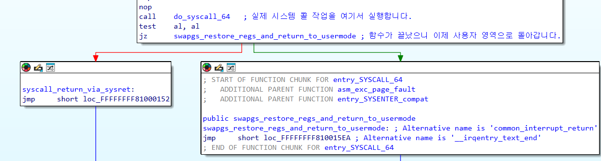
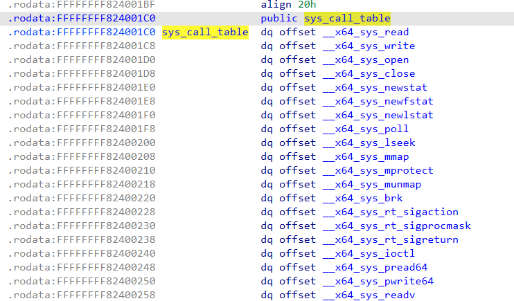
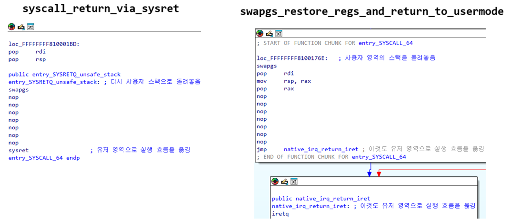

# 2-2. vmlinux 분석하기

vmlinux는 리눅스 시스템의 메모리(RAM)에 적재되어 돌아가는 실제 운영체제 바이너리입니다. 이 파일도 엄연히 리눅스 실행 파일(ELF) 형식이므로, IDA와 같은 디스어셈블러를 사용하여 그 구조를 분석할 수 있습니다.

1장에서 설명한 권한 상승에 필요한 함수인 `prepare_kernel_cred`,`commit_creds`, 2-1장에서 설명한 `entry_SYSCALL_64`와 각종 시스템 호출 함수들을 포함하여 많은 수의 함수들이 이 vmlinux에 정의되어 있습니다.

이제 디스어셈블러를 켜고, vmlinux 파일을 열어 커널의 실제 동작을 분석해 봅시다!

## entry_SYSCALL_64 분석하기

사용자 영역에서 `syscall` 명령어를 실행한 직후 커널에서 실행되는 함수의 시작점인 `entry_SYSCALL_64`을 분석해 봅시다.

아래 사진은 IDA에서 `entry_SYSCALL_64`의 시작 부분의 모습입니다.

여기서 `endbr64` 명령어 바로 다음에 나오는 `swapgs` 라는 명령어가 눈에 보이시나요? 해당 명령어가 시스템 호출의 첫 단추이자, 사용자 데이터 영역에서 커널 데이터 영역으로 전환하는 매우 중요한 명령어입니다.

우리는 `syscall` 명령을 실행하여 CPU를 커널 모드로 전환하고, 실행 흐름(RIP)도 커널 영역으로 옮겼습니다. **하지만 현재 프로세스가 데이터를 읽고 쓰는데 사용하는 스택(RSP,RBP)은 여전히 사용자 영역을 가리키고 있네요!**

만약 커널이 해커가 마음대로 조작할 수 있는 사용자 영역 스택을 그대로 작업에 사용한다면 어떻게 될까요? 보안상 매우 끔찍한 일이 일어날 것입니다. 따라서 커널은 작업을 시작하기 전에, 현재 프로세스가 사용 중인 사용자 영역 스택을 잠시 치워 두고 **안전하게 격리된 '커널 전용 스택' 으로 교체**를 해야 합니다.

### 스택은 어떤 과정을 통해 교체하나요?

앞서 2-1 장에서 gs 레지스터가 시스템 관리와 관련된 정보를 저장한다고 언급했던 것을 기억하시나요? 현대 x86-64 아키텍처에서 gs 레지스터는 **현재 코드를 실행 중인 주체(프로세스 또는 커널)의 핵심 데이터 영역 위치**를 가리킵니다.

- 사용자 프로세스가 실행될 때, gs는 사용자 영역의 데이터를 가리킵니다.
- 하지만 실행 흐름이 커널 영역으로 넘어왔을 때는 커널의 데이터를 사용해야 합니다. 커널 역시 독립적인 데이터 영역을 가지며, 커널용 gs 정보가 따로 저장되어 있습니다.

`swapgs`는 바로 이 사용자 영역의 gs 레지스터와 커널 영역의 gs를 명령어 한 번으로 교체해 주는 특권 명령어 입니다! 이 명령어는 아래와 같이 동작합니다.

1. 커널 모드로 바뀐 gs 영역을 뒤져서, 안전하게 격리된 **커널 전용 스택의 주소**를 가져옵니다.
2. 현재 프로세스가 사용 중이던 사용자 스택은 나중에 돌아갈 때를 위해 커널 메모리 어딘가에 저장해 둡니다.
3. 현재 CPU의 스택 포인터(RSP)를 방금 가져온 커널 전용 스택 주소로 교체합니다.

이제 실행 권한, 실행 흐름(RIP), 그리고 작업 공간(RSP)이 모두 커널 영역으로 설정되었습니다. 운영체제가 안전하게 시스템 호출 작업을 실행할 준비가 끝났습니다! 실행 흐름을 계속 따라가 봅시다.

위 사진에서 보이는 `do_syscall_64` 함수가 바로 실제 시스템 호출 작업을 총괄하는 함수입니다! 이 함수 안에서는 사용자가 전달한 시스템 호출 번호(RAX)를 확인한 뒤, <b>시스템 호출 테이블(System Call Table)</b>을 조회하여 알맞은 함수를 찾아 실행합니다.

vmlinux를 분석해 보면 위 사진처럼 `sys_call_table`이라는 거대한 배열(테이블)이 존재하며, 여기에는 커널이 지원하는 모든 시스템 호출 함수의 시작 주소가 시스템 호출 번호 순서대로 가지런히 기록되어 있습니다.

### 보안 팁 : 테이블이 왜 rodata(읽기 전용) 구역에 있을까요?

이 테이블이 rodata(읽기 전용) 영역에 있는 것에 주목하세요! 만약 이 구역에 쓰기 권한이 있다면, 해커가 이 테이블의 값을 변조하여 함수 자리에 악성코드 시작 주소를 덮어씌울 수 있겠죠? 이렇게 되면 앞으로 특정 시스템 호출이 실행될 때마다 해커의 코드가 실행되는 무서운 사고가 발생합니다. 이를 막기 위해 커널은 이 테이블을 절대 수정할 수 없도록 설정해 둔 것입니다.

## 시스템 호출이 끝났으면 무엇을 하나요?

시스템 호출 작업이 끝났으면 이제 사용자 영역으로 돌아가야 합니다. 위 문단의 사진에서 `do_syscall_64`를 실행한 직후, 두 개의 분기가 보이시나요?

- `syscall_return_via_sysret`
- `swapgs_restore_regs_and_return_to_usermode`

각 분기를 끝까지 따라가보면, 두 경로 모두 `swapgs`를 한 번 더 실행하여 커널 스택을 치우고, 이전에 백업해 두었던 사용자 스택(RSP)과 사용자용 gs로 원상 복구하는 것을 볼 수 있습니다.

그 후 진짜로 사용자 영역으로 돌아가는데, 한 쪽은 `sysret`을, 다른 쪽은 `iretq`를 사용하고 있습니다. 이 둘의 차이점은 무엇일까요?

|명령어|설명|
|---|---|
|sysret|syscall의 완벽한 역과정을 수행합니다. 권한을 사용자 모드로 낮추고, 처음에 R11과 RCX에 백업해 두었던 플래그와 돌아갈 주소(RIP)를 꺼내어 복귀합니다. 일반적으로 시스템 호출이 정상 종료되었을 때 가장 빠르게 복귀하는 방식입니다.|
|iretq|본래 하드웨어 인터럽트나 심각한 예외(Exception)를 처리하고 복귀할 때 쓰는 무거운 명령어입니다. 이 명령어가 실행될 때는 레지스터가 아니라 <b>'현재 사용중인 스택' 최상단에 쌓여있는 5개의 값(RIP, CS, RFLAGS, RSP, SS)을 순서대로 POP 하면서 사용자 영역으로 강제 복귀합니다.</b>|

일반적인 상황에서는 빠른 `sysret`을 사용하지만, 복잡한 신호(Signal) 처리가 필요하거나 특수한 예외가 발생한 상황에서는 `iretq`를 사용합니다.

### 해커의 포인트

`sysret`과 `iretq`의 차이를 명확히 구분하세요. 특히 `iretq`는 실제로 동작하는 모습을 자세히 살펴보세요. 나중에 실습을 할 때, 원래 실행 흐름으로 돌아가기 위해 이 명령어를 제대로 사용할 줄 알아야 합니다!