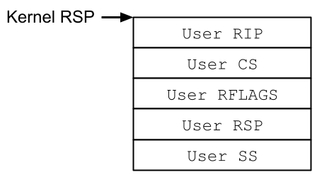

# 2-3. 완벽한 익스플로잇 계획 세우기

이제 우리는 리눅스 커널 해킹을 위해 필요한 핵심 개념과 명령어들을 모두 배웠습니다! 본격적인 공격에 앞서, 현재까지 배운 무기들을 다시 한번 정리해 봅시다.

- `prepare_kernel_cred()` : 새로운 신분증(권한, cred)을 만드는 함수.
- `init_task` : 리눅스 부팅 후 최초의 프로세스(root 권한으로 실행됨)의 정보.
- `commit_creds()` : 현재 프로세스의 신분증을 교체하는 함수.
- `swapgs` : 커널 영역과 사용자 영역의 데이터/스택 영역을 교체하는 특권 명령어.
- `iretq` : 인터럽트(예외) 처리를 마치고 원래의 사용자 영역으로 복귀할 때 사용하는 특권 명령어.

그럼 이제 이번 장에서 우리의 최종 목표인, **커널 영역을 익스플로잇 하여 root 권한을 탈취한 뒤, 다시 사용자 영역으로 안전하게 돌아오는 것**을 어떻게 달성할지 계획을 세워봅시다.

우리는 `syscall` 명령어를 통해 커널 영역으로 넘어왔고, `entry_SYSCALL_64`의 시작점에서 `swapgs`를 통해 커널 영역의 스택을 사용하도록 세팅되었습니다. 그렇다면 목표 달성까지 남은 작업들은 무엇일까요?

바로 아래의 작업들을 순서대로 하는 것입니다!

1. **권한 탈취** : 커널 내부의 취약점(버퍼 오버플로우 등)을 사용하여 `commit_creds(prepare_kernel_cred(&init_task))`를 강제로 실행합니다. 이제 프로세스는 root 권한을 갖습니다.
2. **스택 복귀** : `swapgs` 를 강제로 실행하여 커널 영역으로 맞춰진 스택 상태를 사용자 영역의 것으로 돌려놓습니다.
3. **안전하게 탈출** : 사용자 모드로 권한을 하락시키고, 사용자 영역의 코드로 실행 흐름을 복귀시킵니다.

1번 과정은 1장에서 해보았던 것처럼 커널 스택 버퍼 오버플로우 등 소프트웨어 취약점 익스플로잇 기법을 사용해 진행할 수 있습니다.

<strong>가장 중요하고 까다로운 과정은 바로 복귀 과정인 2, 3번 과정입니다.</strong> 모든 작업을 마치고 사용자 영역으로 돌아가려면 어떤 명령어를 써야 할까요?

우리는 2-2장에서 시스템 호출이 정상적으로 끝날 때는 보통 `sysret` 명령어를 쓴다고 배웠습니다. 하지만 `sysret`은 커널이 정상적인 상태일 때 실행되며, 돌아갈 주소를 RCX 같은 레지스터에서 꺼내옵니다. 익스플로잇 상황에서 해커가 이 레지스터 값들까지 원하는 대로 맞추기는 까다롭습니다.

무엇보다 우리가 공격을 진행하는 시점에는 **커널의 스택 및 힙 등 메모리 영역이 이미 심각하게 훼손(오염)된 상태입니다!** 커널에게 정상적인 복귀 동작(`sysret`)을 기대했다가는 곧바로 운영체제가 멈출(커널 패닉) 확률이 높습니다.

이럴 때 사용할 수 있는 복귀 주문이 바로 `iretq` 명령어 입니다!

`iretq`는 명령어는 사용자 영역으로 복귀할 때 **현재 커널 스택의 최상단(RSP)에 놓인 5개의 값을 차례대로 읽어서 복귀할 주소와 권한 상태를 결정합니다.**

아래 사진은 `iretq`가 실행될 때, 커널이 스택에서 순서대로 꺼내는 5개의 값을 표시한 것입니다.

따라서, 해커는 커널 스택에 \[RIP, CS, RFLAGS, RSP, SS\] 이 5개의 값을 순서대로 기록하고, `iretq` 명령어를 실행하여 커널이 스택에서 이 값들을 꺼내게 합니다. 그러면 커널이 이 값들을 읽어 우리가 원하는 상태로, 사용자 영역으로 돌아갈 수 있게 해줍니다!

이론적인 권한 상승 계획이 완벽하게 세워졌습니다. 이제 이것을 실제 환경에서 실습해 봅시다. 여러분의 손에 root 권한을 넣을 시간입니다!

### 잠깐! iretq가 스택에서 꺼내는 5개의 값은 정확히 무엇인가요?

앞서 2-2장에서 `iretq`는 하드웨어 인터럽트나 심각한 예외(Exception)를 처리하고 복귀할 때 쓰는 무거운 명령어라 설명한 것을 기억하시나요?

프로그램 실행 중 `int 3`(디버그 중단점)나 `SIGSEGV`(잘못된 메모리 접근), 혹은 키보드 입력 같은 하드웨어 요청이 발생하면 CPU에게 <b>인터럽트(Interrupt)</b>가 전송됩니다.

인터럽트를 받은 CPU는 **즉시 현재 하던 일을 잠시 중단하고 커널 모드로 진입하여 인터럽트를 먼저 해결합니다.** 실행하는 작업은 인터럽트 종류마다 다르며, 시스템 호출 테이블처럼 인터럽트 발생 시 실행할 함수들을 모아 놓은 테이블이 운영체제에 정의되어 있습니다.

인터럽트가 종료되면 다시 원래 하던 일을 마저 계속합니다. 그렇다면 운영체제는 어떻게 정확한 실행 흐름 및 상태 등을 기억하고 이를 복귀해 주는 걸까요?

프로세스 실행 중 인터럽트가 발생하면, CPU는 **하드웨어적으로 즉시 커널 모드로 바꾼 다음 먼저 현재 사용자 프로세스의 레지스터 정보 중 커널 스택에 넣습니다.** 스택에 넣는 순서는 \[SS, RSP, RFLAGS, CS, RIP\] 이며, 이것을 <b>트랩 프레임(Trap Frame)</b> 이라 합니다.(트랩이라 부르는 이유는 소프트웨어 실행 중 발생한 인터럽트를 트랩이라 부르기 때문입니다.)

이후 커널 영역에서 여러 연산을 수행한 후, 마지막에 `iretq`를 실행하여 앞서 스택에 저장된 트랩 프레임을 빼고 실행 흐름이 사용자 영역으로 완전히 돌아옵니다.

우리는 해커의 입장이므로, `iretq` 명령어를 아무 때나 실행할 수 있으며 이것이 커널 스택에서 꺼낼 트랩 프레임도 마음대로 작성할 수 있습니다. 그렇다면 트랩 프레임에 정의된 5개 레지스터에는 어떤 값을 넣어야 할까요?

|레지스터|넣어야 할 값|설명|
|---|---|---|
|RIP|원하는 값|**가장 중요한 값**으로, 실행 흐름을 사용자 프로세스로 되돌릴 때 어느 주소의 코드로 이동하는지를 작성합니다.|
|RSP|원하는 값|**RIP과 함께 중요한 값**으로, 스택 주소를 사용자 데이터 영역으로 옮깁니다. 공격자 입장에서는 사용자 프로세스에서 쓰기 권한이 있는 곳이라면 어디든 스택으로 쓸 수 있으므로, 주로 main 함수 등에 큰 배열을 하나 정의하고 해당 영역을 스택처럼 사용합니다.|
|RFLAGS|0x202|이 레지스터는 CPU의 현재 상태를 저장하고 제어하는 레지스터이며, 각 비트마다 0/1 로 상태를 표시합니다. 각 비트별 설명은 [이 사이트](https://en.wikipedia.org/wiki/FLAGS_register)에서 자세히 보실 수 있습니다. 공격자 입장에서는 대부분의 비트들은 중요하지 않습니다. 하지만 Bit 1은 현행 x86-64에서 항상 1로 고정되어 있으며, Bit 9는 하드웨어 인터럽트 허용 여부를 뜻하므로 반드시 1로 설정해야 합니다. 0x202는 이 Bit 1과 Bit 9를 모두 1로 설정합니다.|
|CS|0x33|현재 실행 중인 코드가 32비트/64비트인지, 또 현재 커널 모드가 어떤 Ring인지 정의합니다. 끝 2비트는 3, 즉 Ring 3(사용자 영역)을 의미하며 나머지 비트는 리눅스 커널 코드에서 특정 영역을 참조합니다.|
|SS|0x2B|사용자 영역에서 스택을 가리키는 서술자의 권한 상태를 검증할 때 사용합니다. 작동 원리는 CS와 비슷합니다.|

여기서 우리가 RIP, RSP는 사용자 영역에서 적당한 공간을 만들고, 해당 위치의 주소를 커널에 넘겨 주면 커널이 `iretq` 실행 후 해당 위치로 옮겨줍니다! 그러면 우리가 root 권한을 마음대로 제어할 수 있겠죠? 나머지 3개의 레지스터는 익스플로잇 과정에서 그렇게까지 중요한 레지스터는 아니므로 추가 설명을 생략하겠습니다.

따라서 우리는 `iretq` 이후 스택에 \[RIP, CS, RFLAGS, RSP, SS\] 순서대로 기록해주면, 사용자 영역 복귀 이후의 실행 흐름을 마음대로 제어할 수 있게 됩니다!