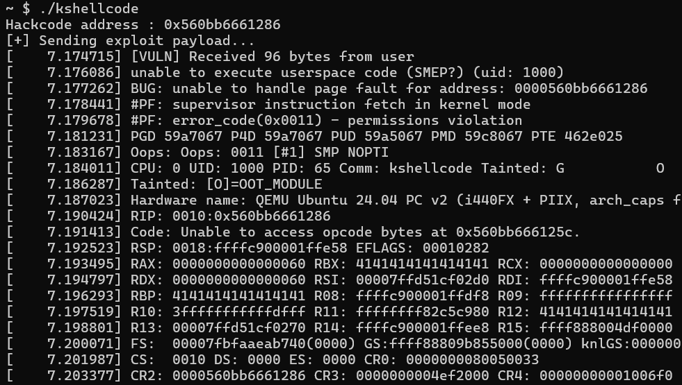
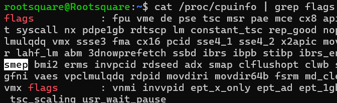

# 3-2. 보호 기법 : SMEP 란 무엇인가요?

SMEP은 Supervisor Mode Execution Prevention의 두문자어로, 이름 그대로 **커널 모드에서는 사용자 영역에 있는 코드를 실행하지 못하게 만드는** 보호 기법입니다.

커널에 SMEP이 설정된 경우, 만약 커널 모드에서 사용자 영역에 배치된 코드를 실행하려 하면 **CPU가 즉시 예외를 발생시키고 커널을 죽입니다.(Panic)**

## SMEP 적용해 보기

실습 자료의 `qemu.sh` 파일을 열고, 아래와 같이 설정을 변경하세요.

```bash
qemu-system-x86_64 \
    (생략)
    -append "root=/dev/ram rw console=ttyS0 oops=panic panic=1 quiet nokaslr nopti nosmap" \  -> 커널 부팅 옵션에서 SMEP을 강제로 끄던 'nosmep' 글자를 지워버립니다.
    (생략)
    -cpu qemu64,+smep \ -> 가상 CPU에 '+smep' 옵션을 주어 하드웨어 SMEP 기능을 켭니다.
    (생략)
```

이제 SMEP가 적용된 설정으로 문제 환경을 다시 빌드하고, 3-1 장에서 보여드린 `kshellcode`를 실행해봅시다.



이번에는 커널 패닉이 발생하며 시스템이 죽어버렸습니다!

커널 로그를 자세히 살펴보세요.

- `unable to execute userspace code (SMEP?) (uid: 1000)` - 사용자 영역의 코드를 실행할 수 없습니다.
- `Code: Unable to access opcode bytes at 0x560bb666125c.` - hackcode 영역에 위치한 코드에 접근할 수 없습니다.

이 경고문들이 바로 **SMEP이 정상적으로 작동하여, 커널이 사용자 영역에 있는 코드(`hackcode`)를 실행하려다 하드웨어에 의해 차단당했음**을 보여줍니다.

### 🤔 어라? 이 설정, 사용자 영역의 NX(No-eXecute)와 비슷하지 않나요?

아주 훌륭한 통찰력입니다! 둘 다 임의 코드를 실행하는 것을 차단하는 역할을 하는 보호 기법(DEP, Data Execution Prevention)입니다. 하지만 작동하는 '결'이 조금 다릅니다.

- **NX** : 데이터, 스택, 힙 등 **프로세스의 코드 영역과 데이터 영역을 구분하고, 코드 영역에만 실행 권한을 부여합니다.** 해커가 스택에 셸코드를 밀어 넣고 그 위치로 점프하는 고전적인 버퍼 오버플로우 공격(Return to shellcode)을 막습니다. (물론 커널의 데이터 영역에도 NX는 적용되어 있습니다.)
- **SMEP** : 실행 권한 유무가 아니라 **권한의 경계(Ring 0 vs Ring 3)를 통제**하는 기법입니다. 우리가 만든 `hackcode()`는 사용자 영역의 코드 영역에 있으므로, 사용자 권한으로 실행할 수 있습니다. 하지만 <b>'아무리 실제 코드라 해도, 사용자 영역의 코드에 접근하는 것은 금지한다!'</b>라고 선을 긋는 것이 바로 SMEP입니다.

따라서, SMEP이 켜져 있는 한, 해커가 유저 영역에 아무리 멋진 커널 셸코드를 짜놓아도 커널은 그것을 실행할 수 없습니다.

## SMEP은 하드웨어적으로 어떻게 구현되어 있을까요?

SMEP은 하드웨어 단에서 동작하는 보호 기법입니다. 그렇다면 CPU는 자신이 SMEP 기능을 활성화 해야 할 지를 어떻게 알 수 있을까요? 바로 2-1장에서 배웠던 **시스템 전용 레지스터**에 그 해답이 있습니다.

수많은 시스템 레지스터 중 **CR4 (Control Register 4)**는 CPU의 각종 고급 기능과 보안 확장을 켜고 끄는 스위치 역할을 합니다. RFLAGS 레지스터가 연산 상태를 비트 단위로 기록하듯, CR4 레지스터 역시 각 비트마다 SMEP을 비롯한 다양한 CPU 기능들의 ON/OFF 상태를 저장하고 있습니다.



위 사진처럼 리눅스 터미널에 `cat /proc/cpuinfo | grep flags`를 입력해 보세요.

화면에 쏟아지는 수많은 설정값들 사이 **smep**이라는 단어가 보이시나요? 이것이 바로 현재 CPU가 CR4 레지스터 등을 통해 SMEP을 비롯한 보호 기법들을 활성화 해 두었다는 뜻입니다.(CR4 레지스터의 비트별 상세한 기능이 궁금하시다면 [이 사이트](https://wiki.osdev.org/CPU_Registers_x86-64#CR4)를 참고해 보세요.)

### 잠깐! 그럼 저 시스템 레지스터들을 조작해서 SMEP 등 보호 기법을 꺼버리면 안 되나요?

"어차피 커널 권한으로 실행 흐름을 훔쳤으면, `mov CR4, rax` 등 명령어로 CR4를 조작해서 보호 기법만 끄면 되지 않나요?"

**네, 원리상으로는 완벽하게 가능합니다!** 실제로 과거의 커널 해커들은 KROP를 통해 CR4 레지스터의 SMEP 비트를 꺼버린 뒤, 마음 편하게 유저 영역의 셸코드를 실행(ret2usr)하는 방식을 즐겨 사용했습니다.

**하지만 현대의 리눅스 커널은 이런 꼼수를 더 이상 허락하지 않습니다.**
커널 개발자들은 해커들의 이런 수법을 눈치채고 <b>CR4 Pinning(고정)</b>이라는 강력한 방어 로직을 v5.3 이후부터 커널에 심어두었습니다. 특정 시스템 레지스터의 값을 강제로 고정하는 기술입니다.

정상적인 커널은 부팅이 끝난 이후 운영 중에 CR4 레지스터의 보안 설정 값을 바꿀 일이 전혀 없습니다.

현대 리눅스는 **실행 도중 CR4 레지스터의 값이 1비트라도 변경되는 순간, 해킹 공격으로 간주하고 그 즉시 커널을 죽여버립니다!** 따라서 SMEP을 인위적으로 끄는 행위는 아쉽게도 불가능합니다.