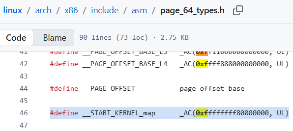
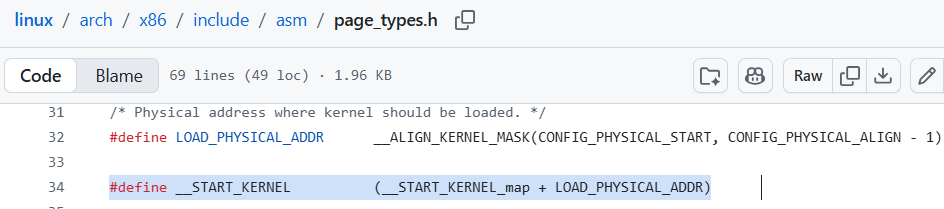

# 4-2. 리눅스 커널은 메모리의 어디에 적재될까?

4-1에서 우리는 x86-64 주소 체계에서 커널 영역이 상위 절반(Upper Half, `0xffff8000...` 시작)에 위치하며, 커널 바이너리인 `vmlinux`가 바로 이 영역에 적재된다는 것을 배웠습니다.

그렇다면 컴퓨터가 부팅될 때, 이 거대한 운영체제는 저 넓은 Upper Half 영역 중에서도 **정확히 어느 주소에** 자리를 잡을까요?

## 커널의 시작 주소 찾기

리눅스의 창시자, 리누스 토르발즈가 [Github에 공개한 리눅스 커널 소스 코드](https://github.com/torvalds/linux/)를 직접 열어 확인해 봅시다.

먼저 커널 메모리 맵을 정의하는 헤더 파일을 보면, `__START_KERNEL_map`이라는 변수에 `0xffffffff80000000`이라는 값이 설정된 것이 보이시나요? 이 주소가 바로 리눅스 커널이 적재되기 시작하는 논리 주소의 기준점(Base)입니다.

어라? 3장에서 우리가 KROP 익스플로잇 코드를 짤 때 사용했던 가젯들의 주소가 전부 `0xffffffff...`로 시작했던 이유가 바로 여기에 있었군요!

그리고 다음 코드를 보면, 커널의 진짜 코드 영역이 적재되는 실제 시작 주소인 `\_\_START\_KERNEL`을 계산하는 공식이 나옵니다.

<b>공식 : `__START_KERNEL = __START_KERNEL_map + LOAD_PHYSICAL_ADDR`</b>

여기서 `LOAD_PHYSICAL_ADDR`는 하드웨어 물리 메모리상에서 커널이 올라갈 오프셋으로, 기본값이 `0x1000000` (16MB)로 지정되어 있습니다. (참고로 맨 앞 16MB 구간은 전통적으로 PC 하드웨어의 BIOS, 부트로더, 레거시 장치들을 위해 예약된 공간이랍니다.)

자, 그럼 `__START_KERNEL`을 계산해 볼까요?

`__START_KERNEL = 0xffffffff80000000 + 0x1000000 = 0xffffffff81000000`

따라서 리눅스가 부팅된 후, 커널 코드가 메모리에 적재되는 최초의 시작 주소는 언제나 `0xffffffff81000000`입니다!

지금까지 우리가 편하게 커널 익스플로잇을 할 수 있었던 

## 커널의 주소가 항상 같다면 무엇이 문제일까?

하지만 위처럼 커널이 부팅할 때마다 항상 같은 위치에 적재되면, 해커 입장에서는 항상 같은 주소에 있는 함수들 및 가젯 주소들을 사용하여 쉽게 커널을 공격할 수 있습니다. 

이를 예방하기 위해 현대 리눅스 커널 개발자들은 공격자가 필요한 주소값들을 사전에 알고 쓰지 못하도록 또 다른 보호 기법을 커널에 적용했습니다. 함수들의 주소를 무작위로 배치해 버리는 두 번째 보호 기법인 KASLR을 소개합니다.