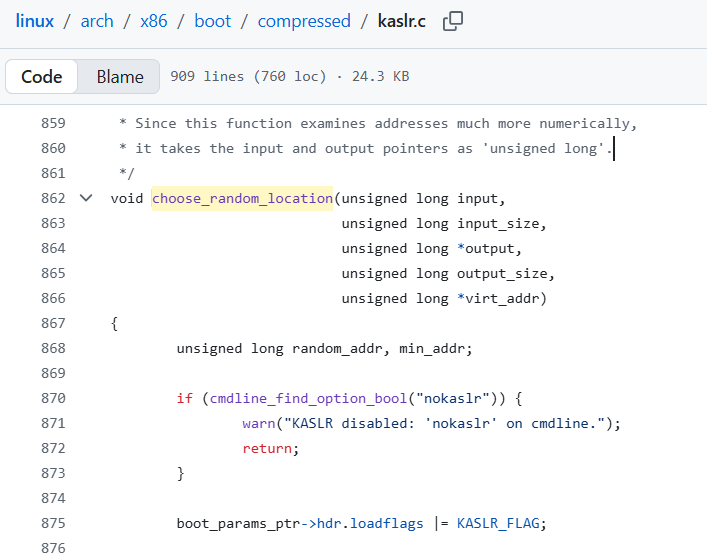
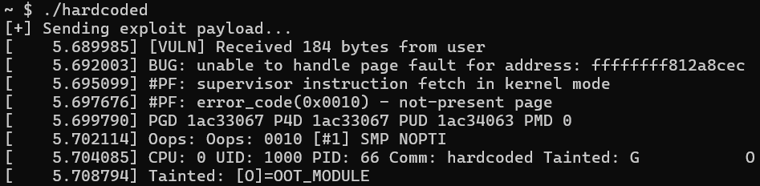
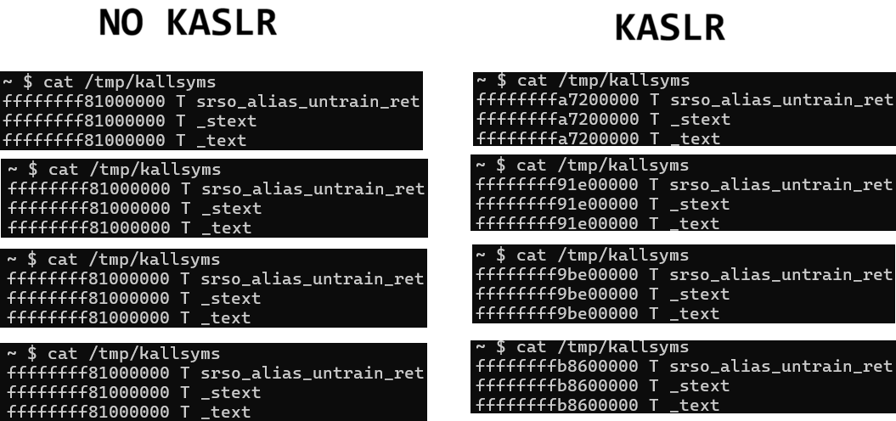

# 4-3. 보호 기법 : KASLR 이란 무엇인가요?

KASLR는 Kernel-Address Space Layout Randomization의 두문자어로, 이름 그대로 유저 영역 프로그램에서 사용하던 ASLR을 커널 바이너리인 `vmlinux`에 그대로 적용한 것입니다.

커널에 KASLR이 설정된 경우, 커널을 재부팅(시스템을 껐다가 다시 켜기)할 때마다 커널 코드가 메모리에 적재되는 시작 주소가 무작위로 변하게 됩니다. 이렇게 되면 매 실행마다 `commit_creds`나 `swapgs` 등 함수나 가젯의 주소가 바뀌므로, 우리가 3장에서 성공했던 것처럼 **주소를 하드코딩(고정)해서 공격하는 방식은 더 이상 통하지 않게 됩니다.**

## KASLR은 어디에 정의되어 있을까?

KASLR 역시 앞서 본 리눅스 커널 소스 코드에 정의되어 있습니다.



먼저 `choose_random_location` 함수를 보세요. 이 함수에서는 부팅 시 무작위 난수를 생성하여 커널이 적재될 무작위 위치를 설정합니다.

주소를 구하는 공식은 `__START_KERNEL + (무작위 값)`으로, 앞에서 계산한 커널의 기본 적재 주소에 무작위 값을 더한 만큼 뒤쪽에 배치하는 구조입니다.

동시에 `cmdline_find_option_bool("nokaslr")` 라는 코드도 보이시나요? 부팅할 때 KASLR을 사용하지 않겠다는 옵션이 있다면 이 작업을 실행하지 않는답니다.

응용 프로그램의 ASLR처럼 스택, 힙 등 영역도 다른 비슷한 함수를 통해 시작 주소가 무작위로 설정된답니다.

## KASLR 적용해보기

진짜로 공격이 막히는지 실습을 해 봅시다. 실습 자료 폴더(`src/sample`) 안에 있는 `kaslr.zip` 파일을 다운로드하여 압축을 풀어주세요. 이번 실험 환경의 `vuln.ko` 역시 버퍼 오버플로 취약점을 가지고 있습니다.

실습 환경 안에 `hardcoded`라는 바이너리가 보이시나요? 이것은 우리가 3-3장에서 작성했던 하드코딩한 주소 기반의 KROP 익스플로잇 C 코드를 그대로 컴파일한 것입니다. 먼저 이 파일을 실행해서 정상적으로 root 셸이 획득되는지 확인하세요.

확인했다면, 이제 `qemu.sh` 파일을 열고 KASLR을 켜보겠습니다. (이번 환경에는 SMEP도 함께 적용되어 있습니다.)

```bash
qemu-system-x86_64 \
    (생략)
    -append "root=/dev/ram rw console=ttyS0 oops=panic panic=1 quiet nopti nosmap" \  -> 커널 부팅 옵션에서 KASLR을 강제로 끄던 'nokaslr' 글자를 지워버립니다.
    (생략)
```

이제 KASLR이 적용된 설정으로 문제 환경을 다시 빌드하고, `hardcoded`를 실행해 봅시다.



이번에도 커널 패닉이 발생하며 시스템이 죽어버렸습니다!

오류 메시지를 살펴보면, 우리가 하드코딩으로 설정했던 주소들을 커널이 알 수 없는 주소(not-present page)라고 밝혔습니다. 가젯들이 있어야 할 주소가 빈 자리이거나 엉뚱한 코드 영역이었기 때문입니다.

그렇다면 정말로 주소가 바뀌고 있는 것일까요? `/tmp/kallsyms` 파일을 읽어 커널 코드 영역의 진짜 시작 주소인 `T _text` 심볼의 값을 확인해 봅시다.



왼쪽처럼 KASLR이 적용되지 않은 경우에는 시작 주소가 4-2 에서 구한 대로 항상 `0xffffffff81000000`이지만, **오른쪽처럼 KASLR이 적용되면 이 값이 재부팅을 할 때마다 변하는 것을 볼 수 있습니다!**

> **🚨 KASLR이 사실은 구조적인 약점이 있다?!**
>
> 위 사진에서 KASLR이 적용되었을 때 나온 무작위 주소들을 아주 자세히 관찰해 보세요. 무언가 이상한 점이 보이지 않나요?
>
> 1. **상위 8자리 고정** : 앞선 4-1장에서 배웠듯 커널은 반드시 Upper Half 공간에 존재해야 하므로, 주소의 앞부분인 `0xffffffff...` (상위 8자리)는 절대 변하지 않습니다.
> 2. **하위 5자리 고정** : 커널은 시스템 성능 최적화를 위해 메모리를 아주 큼직한 '2MB 단위' 페이지로 잘라(Alignment) 관리합니다. 유저 영역(4KB)보다 크기가 훨씬 크죠. 이 2MB(0x200000) 단위의 배수로만 주소를 이동시킬 수 있기 때문에, **놀랍게도 뒤쪽의 하위 5자리(예: 00000)도 절대 변하지 않습니다!**
>
> 결국 커널의 시작 주소가 아무리 무작위로 설정된다 해도, **실제로 바뀌는 부분은 중간에 끼어있는 고작 3자리 (약 9~10비트 정도)**에 불과합니다.
>
> 유저 영역의 ASLR에 비하면 턱없이 약한 강도입니다. 이 정도 확률이라면 브루트포스로 약 1000 번 정도 시도하면 한 번은 성공할 수준입니다.
>
>> 💡 참고 : 더 강력한 KASLR도 있었다?
>>
>> 리눅스 커뮤니티도 KASLR의 한계를 인지하고, **바이너리 내 함수 단위로** 무작위화를 거는 [FG-KASLR(Function Granular KASLR)](https://lwn.net/Articles/824307/)가 제시된 적이 있었으나, 커널 디버깅이 불편해지고 시스템 성능이 크게 하락하는 문제가 있어 결국 채택되지 않았습니다.
>
> 하지만 커널에 브루트포스 공격을 하는 것은 매우 치명적인 리스크를 동반합니다. 익스플로잇이 실패하면 커널 패닉이 발생하여 컴퓨터가 멈추고 재부팅되어 버리기 때문입니다. 서버 관리자에게 공격 시도를 100% 들키게 되겠죠. 그러니 KASLR은 충분히 유효한 보호 기법이라 할 수 있습니다.
