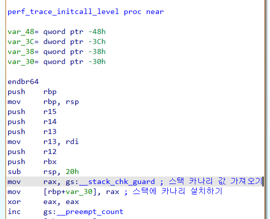
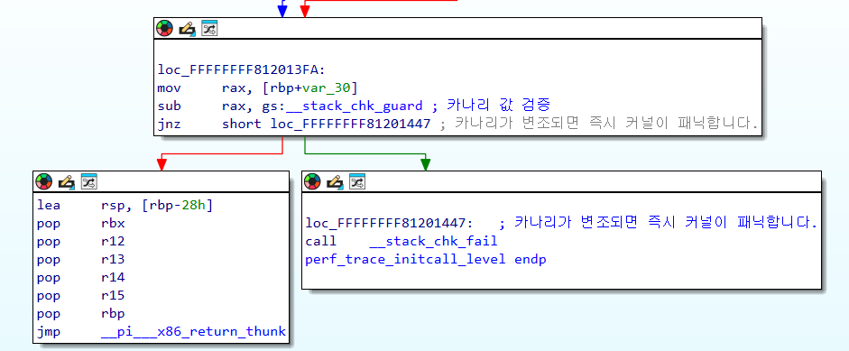
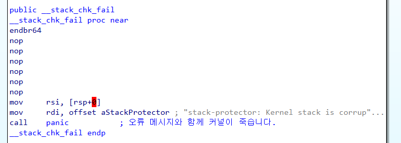
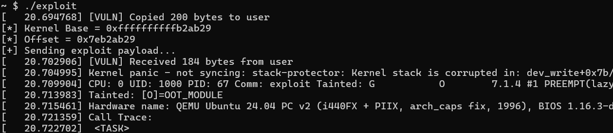
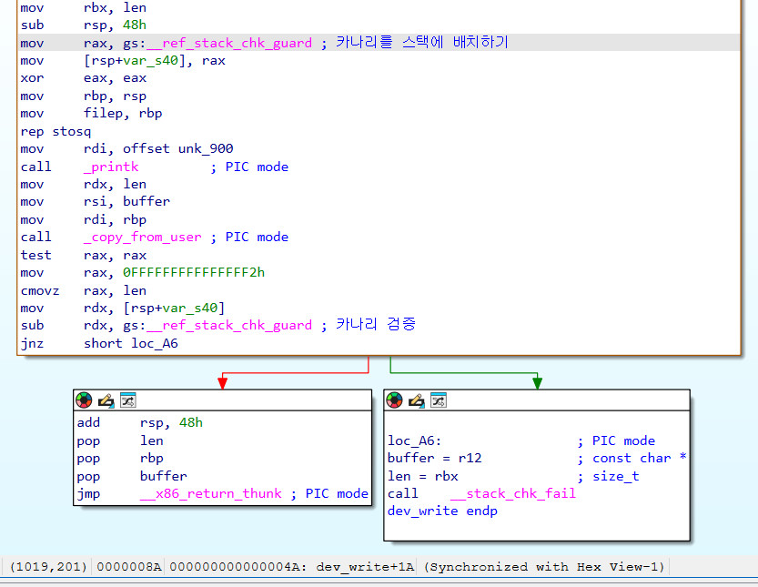

# 5-1. 보호 기법 : 스택 카나리(Canary, SSP)란 무엇인가요?

스택 카나리(Stack Canary, SSP)는 프로세스의 스택에 설치되는 무작위 값으로, 프로세스에서 스택 버퍼 오버플로 계열의 공격을 방지하는데 사용됩니다.

> **SSP가 무엇인가요?**
>
> SSP는 Stack Smashing Protector의 두문자어로, 스택 카나리와 의미상 같습니다. 스택 버퍼 오버플로를 스택 스매싱(Stack Smashing)이라고도 부르기 때문입니다.

원리는 유저 영역의 프로그램에서의 스택 카나리와 완전히 같습니다!

커널에서 함수를 실행할 때, 함수의 반환 주소(RET) 바로 앞에 운영체제만 알고 있는 무작위 난수(카나리)를 배치합니다. 이후 함수가 종료되기 전에 이 배치된 카나리 값이 변조되었는지 확인하고, 만약 변조되었으면 즉시 커널 패닉이 발생합니다. 따라서 해커는 카나리 값을 바르게 덮지 못할 경우 스택 버퍼 오버플로 공격을 할 수 없습니다.

## 커널에 스택 카나리를 설치하는 방법

SMEP이나 KASLR은 QEMU 부팅 옵션(nosmep, nokaslr)으로 켜고 끌 수 있었지만, 스택 카나리는 다릅니다. **이 기법은 '커널을 컴파일할 때'부터 컴파일러(GCC)가 함수들 사이에 스택 카나리 관련 코드를 직접 주입해야 하므로, 커널 빌드 단계에서 옵션을 켜주어야 합니다.**

0장에서 커널 소스를 다운로드했던 `kernel/linux-...` 폴더를 기억하시나요? 리눅스 커널 이미지를 만들었던 곳인데, 그때는 실습의 편의성을 위해 스택 카나리를 비활성화한 채로 빌드했습니다. 이제 환경을 초기화하고, 실제 커널처럼 스택 카나리를 적용하여 빌드를 해 봅시다.

해당 폴더에서 터미널을 열고 아래 명령어들을 순서대로 실행하세요.

```bash
make distclean # 모든 설정을 초기화합니다. 커널 컴파일을 처음부터 할 때 사용합니다.
make defconfig # 기본 환경 설정을 불러옵니다. 기본적으로 카나리가 켜져 있습니다.
./scripts/config --enable CONFIG_RANDOMIZE_BASE
./scripts/config --enable CONFIG_PAGE_TABLE_ISOLATION
./scripts/config --enable CONFIG_DEBUG_KERNEL
./scripts/config --enable CONFIG_DEBUG_INFO_DWARF_TOOLCHAIN_DEFAULT
./scripts/config --enable CONFIG_KALLSYMS
./scripts/config --enable CONFIG_KALLSYMS_ALL
make olddefconfig # 변경된 환경 설정을 적용합니다.
make -j$(nproc) # 커널을 컴파일합니다.
```

컴파일이 끝나면 새로 만들어진 `bzImage`와 `vmlinux`를 저장하세요. 이것이 스택 카나리가 적용된 새 커널 파일입니다!

## 스택 카나리는 커널 코드에서 어떻게 생겼을까?

이제 새로 만들어진 `vmlinux`에서 스택 카나리를 찾아봅시다! 디스어셈블러(IDA 등)로 새로운 커널 파일을 분석해 보세요.

여기서는 커널 내 여러 함수들 중 `perf_trace_initcall_level`을 예시로 살펴보겠습니다.



함수 시작부(프롤로그)에 `mov rax, gs:__stack_chk_guard`라는 코드가 보이시나요? 이 `gs:__stack_chk_guard`가 바로 커널의 스택 카나리랍니다! 유저 영역과는 다르게 생겼죠? 이후 `mov [rbp+var_30], rax`를 통해 카나리가 스택에 배치됩니다.

이제 함수의 끝 부분(에필로그)을 살펴볼까요?



처음에 스택에 배치한 카나리 값을 gs 레지스터가 가진 원본 카나리 값을 비교합니다. 만약 두 값이 다르면 `__stack_chk_fail` 함수가 호출됩니다.



커널에서는 `__stack_chk_fail` 함수가 실행되면, 오류 메시지를 띄우고 커널이 즉시 `panic()`을 실행하고 죽습니다.

## 스택 카나리 적용하기

스택 카나리가 진짜로 공격을 막아주는지 실습을 해 봅시다. 실습 자료 폴더(`src/sample`) 안에 있는 `canary.zip` 파일을 다운로드하여 압축을 풀어주세요. 이번 실험 환경의 `vuln.ko` 역시 4장과 똑같습니다.

실습 환경 안에 `default`라는 바이너리가 우리가 4장에서 사용했던 익스플로잇입니다. 해당 파일을 실행해 보세요.



이번에도 커널 패닉이 발생했습니다!

오류 메시지를 살펴보면 `Kernel stack is corrupted...` 가 보이시나요? 이것이 바로 스택 카나리가 변조되었을 때 나오는 오류 메시지입니다.

### 🤔 잠깐! 모듈에도 카나리가 있나요?

잠깐, 그런데 지금 `dev_write` 에서 저 메시지가 나왔군요? 혹시 모듈이 변한 것일까요? 카나리는 원래 커널 바이너리에만 적용된 것 아니었나요?  IDA를 통해 모듈을 살펴봅시다.



어라? 우리는 커널 모듈의 소스 코드를 바꾼 적이 없는데, `dev_write`, 심지어 `dev_read` 에도 스택 카나리 로직이 추가되어 있네요!

우리가 1-1 에서 커널 모듈을 컴파일할 때, `Makefile`에 `KDIR`를 설정한 것을 기억하시나요?

리눅스에서 커널 모듈(`.ko`)을 빌드할 때는 반드시 자신이 적재될 뼈대 커널(`vmlinux`)의 컴파일 설정(`.config`)을 그대로 물려받아(상속) 똑같은 조건으로 컴파일되어야 합니다.

우리는 스택 카나리가 적용된 커널을 만들었으므로, `vuln.ko` 모듈을 빌드할 때도 컴파일러(GCC)가 알아서 모듈 안의 모든 함수에 스택 카나리 코드를 첨가해 준 것입니다.